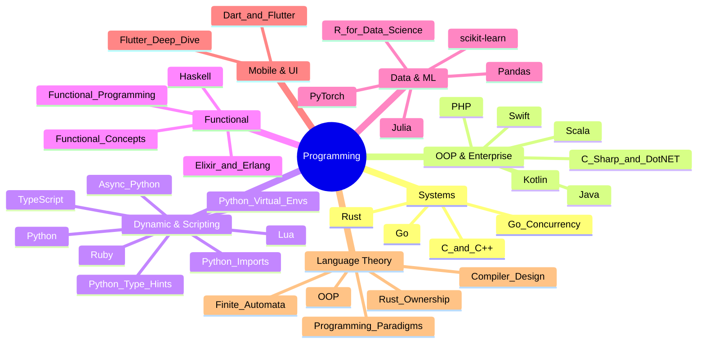

# 💻 Programming Languages — Map of Content

**Parent**: [[../_MOC|Web Development]]

Programming languages shape how we think about problems. This folder covers 34 language and framework deep dives — from systems languages (Rust, Go, C++) to high-level paradigms (Python, Haskell, Julia), plus compiler design, automata theory, and specialized frameworks (PyTorch, scikit-learn). Use the guide below to find the right language for your domain.

## Topics

| Category | Languages |
|----------|-----------|
| **Systems Programming** | [[Rust]], [[Rust Ownership and Borrowing]], [[C and C++]], [[Go Programming]], [[Go Concurrency Patterns]] |
| **OOP & Enterprise** | [[Java]], [[C Sharp and DotNET]], [[Kotlin]], [[Scala]], [[Swift and iOS Development]], [[PHP]] |
| **Dynamic & Scripting** | [[Python Deep Dive]], [[Async Python]], [[Python Imports and Modules]], [[Python Type Hints]], [[Python Virtual Environments]], [[Ruby]], [[Lua Scripting]], [[TypeScript]] |
| **Functional** | [[Haskell]], [[Elixir and Erlang]], [[Functional Programming]], [[Functional Programming Concepts]] |
| **Data Science & ML** | [[Pandas for Data Analysis]], [[PyTorch Deep Dive]], [[scikit-learn Deep Dive]], [[R for Data Science]], [[Julia]] |
| **Mobile & UI** | [[Dart and Flutter]], [[Flutter Deep Dive]] |
| **Language Theory** | [[Compiler Design]], [[Finite Automata and Formal Languages]], [[Programming Language Paradigms]], [[Object-Oriented Programming]] |

## Cross-Domain Links

- [[Python Deep Dive]] → [[../../Data-Science/Pandas/_MOC|Pandas]], [[../../Data-Science/NumPy/_MOC|NumPy]], [[../../AI-ML/Deep-Learning/_MOC|Deep Learning]]
- [[Rust]] → [[../../System-Design/Architecture/Memory Management|Memory Management]], [[../../System-Design/Databases/Database Engines Compared|Database Engines]]
- [[Go Programming]] → [[../../DevOps/Containers/Docker Containers|Docker]], [[../../System-Design/Architecture/Microservices Architecture|Microservices]]
- [[PyTorch Deep Dive]] → [[../../AI-ML/Deep-Learning/_MOC|Deep Learning]], [[../../AI-ML/Deep-Learning/Machine-Learning/_MOC|Machine Learning]]
- [[scikit-learn Deep Dive]] → [[../../AI-ML/Deep-Learning/Machine-Learning/_MOC|ML MOC]], [[../../Data-Science/_MOC|Data Science]]
- [[Go Concurrency Patterns]] → [[../../System-Design/Architecture/Concurrency Models|Concurrency Models]]
- [[Functional Programming]] → [[../../System-Design/Databases/Event Sourcing|Event Sourcing]]
- [[TypeScript]] → [[../React|React]], [[../Angular|Angular]]
- [[Java]] → [[../State Management Patterns|State Management]]
- [[Compiler Design]] → [[../../System-Design/Architecture/Computer Architecture and Organization|Computer Architecture]]
