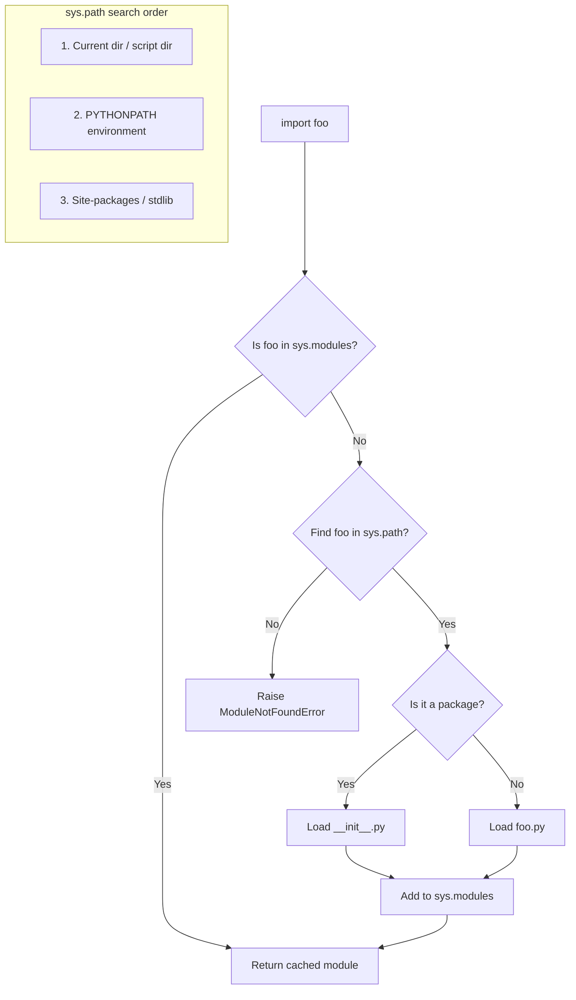

# Python Imports and Modules

Python's import system organizes code into modules (single files) and packages (directories with `__init__.py`). The import machinery searches `sys.path` for modules.

## Module Resolution



## Module Structure

```
my_project/
├── main.py
├── utils/
│   ├── __init__.py
│   ├── strings.py
│   └── math.py
└── tests/
    └── test_strings.py
```

## Import Types

```python
import os                              # Full module
from os.path import join, exists       # Specific names
import numpy as np                     # Aliased
from collections import defaultdict, Counter  # Multiple names
from .strings import capitalize        # Relative import
from ..models import User              # Parent package relative

# Dynamic import (Python 3.11+)
module = importlib.import_module("utils.strings")
```

## __init__.py Controls Exports

```python
# utils/__init__.py
from .strings import capitalize, reverse
from .math import factorial, fibonacci

__all__ = ["capitalize", "reverse", "factorial", "fibonacci"]
```

## Circular Import Handling

```python
# PROBLEM: a.py imports b.py, b.py imports a.py

# SOLUTION 1: Defer import inside function
# a.py
class A:
    def get_b(self):
        from b import B  # Late import
        return B()

# SOLUTION 2: Restructure into common base
# common.py — shared types
# a.py imports common; b.py imports common

# SOLUTION 3: Use TYPE_CHECKING for type hints only
from __future__ import annotations
from typing import TYPE_CHECKING
if TYPE_CHECKING:
    from b import B  # Only evaluated during type checking
```

## __name__ == "__main__"

```python
def main():
    """Entry point when run directly."""
    print("Running directly")

if __name__ == "__main__":
    main()
```

## Common Pitfalls

| Pitfall | Cause | Solution |
|---------|-------|----------|
| Circular imports | Mutual dependency | Restructure, late imports |
| ModuleNotFoundError | Module not in sys.path | Check PYTHONPATH, install package |
| Relative import outside package | Running script directly | Use `python -m package.module` |
| Side effects at module level | Executed on import | Wrap in main(), use lazy imports |
| Stale bytecode (.pyc) | Cached old version | Delete `__pycache__` |
| Namespace collision | Same name as stdlib | Rename module (avoid `string.py`, `math.py`) |

## Import Performance

```python
# Slow - imports everything
import heavy_library

# Fast - imports on demand
def use_heavy():
    import heavy_library  # Deferred until called

# Fast - lazy import with importlib
from importlib import import_module

def get_scipy():
    return import_module("scipy")
```

**Links**: [[Dev Environment Setup]] | [[Python Virtual Environments]] | [[Unit Testing Guide]] | [[Code Architecture Patterns]] | [[Object-Oriented Programming]]

**Next**: [[Object-Oriented Programming]] — OOP fundamentals
