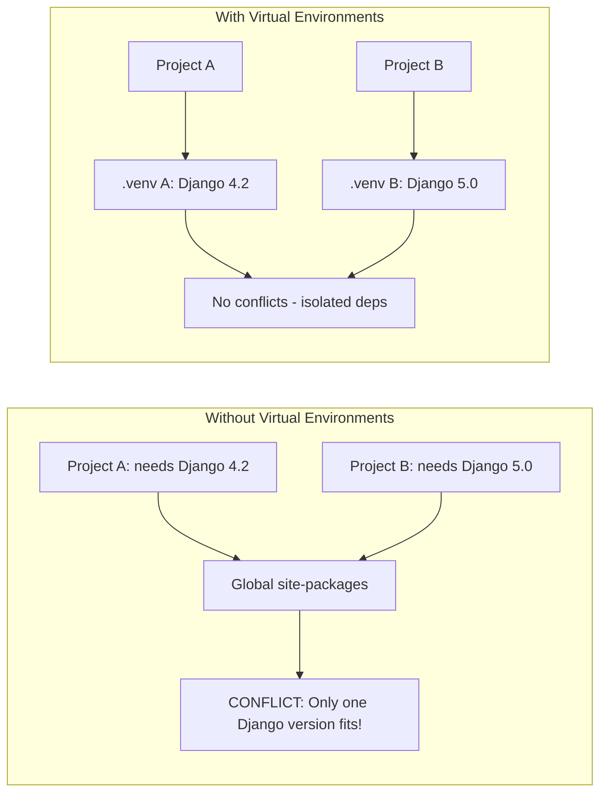

# Python Virtual Environments

Virtual environments isolate Python dependencies per project, preventing version conflicts. Each environment has its own `site-packages` directory and Python binary.

## Why Virtual Environments?



## Tools Compared

| Tool | Speed | Lock File | Features | Best For |
|------|-------|-----------|----------|----------|
| venv | Fast | No | Built-in, minimal | Simple projects, std library only |
| pipenv | Slow | Pipfile.lock | Combines pip + virtualenv | Dependency graph management |
| Poetry | Medium | poetry.lock | Build system + deps | Library publishing, modern projects |
| uv | Very fast | uv.lock | Rust-based, drop-in pip replacement | Speed-critical workflows |
| conda | Medium | environment.yml | Non-Python deps too | Data science, ML projects |

## Basic venv Workflow

```bash
# Create virtual environment
python -m venv .venv

# Activate (Linux/Mac)
source .venv/bin/activate

# Activate (Windows PowerShell)
.venv\Scripts\Activate.ps1

# Activate (Windows CMD)
.venv\Scripts\activate.bat

# Install dependencies
pip install -r requirements.txt

# Deactivate
deactivate
```

## Using uv (Modern Alternative)

```bash
# Install uv
pip install uv

# Create and activate
uv venv
source .venv/bin/activate

# Install dependencies (10-100x faster than pip)
uv pip install -r requirements.txt

# Lock dependencies
uv pip compile requirements.txt -o requirements.lock

# Sync from lock file
uv pip sync requirements.lock
```

## Dependency Management

```txt
# requirements.txt — pin exact versions
django==4.2.10
celery==5.3.6
redis==5.0.3
pydantic==2.5.3

# requirements-dev.txt — dev-only dependencies
-r requirements.txt
pytest==8.0.0
black==24.1.1
mypy==1.8.0
```

## Best Practices

- Always use a virtual environment per project — never install globally
- Add `.venv/` to `.gitignore` and `requirements.txt` to version control
- Pin exact versions in requirements.txt or use lock files for reproducible builds
- Use `pip freeze > requirements.txt` to capture current state
- Consider `pyproject.toml` (PEP 621) for modern project metadata
- Use `pip-audit` to check for known vulnerabilities

```bash
# Export current environment
pip freeze > requirements.txt

# Check for vulnerabilities
pip install pip-audit
pip-audit
```

**See also**: [[Dev Environment Setup]], [[Docker Containers]], [[Git Version Control]]

**Links**: [[Async Python]] | [[C and C++]] | [[C Sharp and DotNET]] | [[Compiler Design]] | [[Dart and Flutter]] | [[Elixir and Erlang]] | [[Finite Automata and Formal Languages]] | [[Flutter Deep Dive]] | [[Functional Programming Concepts]] | [[Functional Programming]] | [[Go Concurrency Patterns]] | [[Go Programming]] | [[Haskell]] | [[Java]] | [[Julia]] | [[Kotlin]] | [[Lua Scripting]] | [[Object-Oriented Programming]] | [[Pandas for Data Analysis]] | [[PHP]] | [[Programming Language Paradigms]] | [[Python Deep Dive]] | [[Python Imports and Modules]] | [[Python Type Hints]] | [[PyTorch Deep Dive]] | [[R for Data Science]] | [[Ruby]] | [[Rust Ownership and Borrowing]] | [[Rust]] | [[Scala]] | [[scikit-learn Deep Dive]] | [[Swift and iOS Development]] | [[TypeScript]]
