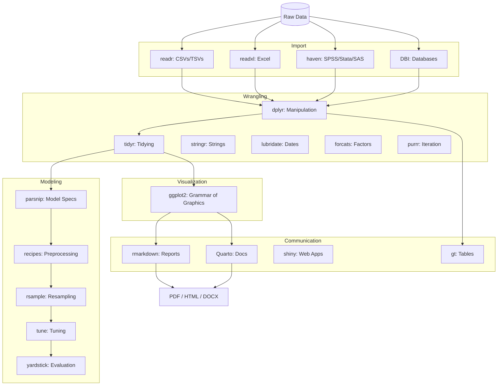
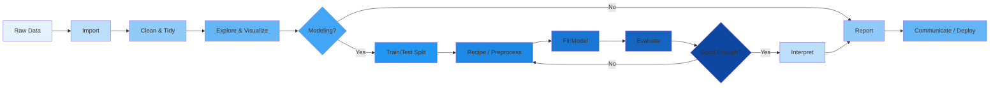

# R for Data Science

R is a language designed for statistical computing, data analysis, and visualization. The tidyverse ecosystem makes data manipulation intuitive.

## Why R?

| Strength | Description |
|----------|-------------|
| Statistics | Born for it — built-in distributions, tests, models |
| Visualization | ggplot2 is the gold standard |
| Reproducible research | R Markdown, Quarto |
| Package ecosystem | CRAN (20K+ packages) |
| Data wrangling | dplyr, tidyr — intuitive pipeline |

## Tidyverse

```r
library(tidyverse)

# Data pipeline
result <- data %>%
    filter(status == "active") %>%
    mutate(age_group = cut(age, breaks = c(0, 18, 35, 50, 100))) %>%
    group_by(age_group, region) %>%
    summarise(
        count = n(),
        avg_amount = mean(amount, na.rm = TRUE),
        .groups = "drop"
    ) %>%
    arrange(desc(count))
```

## Data Visualization (ggplot2)

```r
library(ggplot2)

# Grammar of graphics
ggplot(data, aes(x = age, y = income, color = region)) +
    geom_point(alpha = 0.5) +
    geom_smooth(method = "lm", se = TRUE) +
    labs(
        title = "Income vs Age by Region",
        x = "Age (years)",
        y = "Annual Income ($)"
    ) +
    theme_minimal() +
    facet_wrap(~region)
```

## Statistical Modeling

```r
# Linear regression
model <- lm(income ~ age + education + region, data = data)
summary(model)

# Logistic regression
model <- glm(churn ~ tenure + contract_type + monthly_charges,
             data = data, family = binomial)
predictions <- predict(model, new_data, type = "response")

# Mixed effects
library(lme4)
model <- lmer(score ~ treatment + (1 | subject), data = data)
```

## R Markdown

```markdown
---
title: "Analysis Report"
output: html_document
---

## Data Summary

```{r}
summary(data)
```

```{r echo=FALSE}
ggplot(data, aes(x = age)) + geom_histogram()
```

## Model Results
The model shows a significant effect of treatment (p < 0.01).
```

## Common Packages

| Package | Purpose |
|---------|---------|
| dplyr | Data manipulation |
| tidyr | Data tidying |
| ggplot2 | Visualization |
| lubridate | Date/time handling |
| stringr | String operations |
| purrr | Functional programming |
| shiny | Interactive web apps |
| data.table | Fast data operations |
| caret | ML training framework |
| rmarkdown | Reproducible reports |

## vs Python for Data Science

| Aspect | R | Python |
|--------|---|--------|
| Statistics | Better built-in | Needs libraries |
| Visualization | ggplot2 (superior) | matplotlib/seaborn |
| ML/DL | caret, tidymodels | scikit-learn, PyTorch |
| Production | Harder | Easier |
| Data exploration | Better (interactive) | Good |
| Ecosystem | CRAN | PyPI |

## Tidyverse Ecosystem Map



## Data Import

### readr — Flat Files

```r
library(readr)

# Specify column types for performance and correctness
df <- read_csv("data.csv",
    col_types = cols(
        date = col_date("%Y-%m-%d"),
        amount = col_double(),
        category = col_factor(),
        id = col_character()
    ),
    na = c("", "NA", "NULL"),
    skip = 0,
    n_max = Inf
)

# Delimited files
df <- read_delim("data.txt", delim = "|", quote = "\"")

# Write with options
write_csv(df, "output.csv", na = "")
write_tsv(df, "output.tsv")
write_rds(df, "compressed.rds", compress = "bz2")
```

### readxl — Excel Files

```r
library(readxl)

# Explore workbook
excel_sheets("report.xlsx")

# Read by name or position
df <- read_excel("report.xlsx", sheet = "Sheet1")
df <- read_excel("report.xlsx", sheet = 2)

# Range and column types
df <- read_excel("data.xlsx",
    range = "A1:G100",
    col_types = c("text", "date", "numeric", "numeric", "text", "text", "numeric"),
    na = "NA"
)

# Read all sheets into a list
all_sheets <- excel_sheets("data.xlsx") %>%
    set_names() %>%
    map(~ read_excel("data.xlsx", sheet = .x))
```

### haven — SPSS, Stata, SAS

```r
library(haven)

# SPSS (.sav)
df <- read_sav("survey.sav")
df <- read_por("survey.por")  # Portable SPSS

# Stata (.dta)
df <- read_dta("data.dta")
attr(df$variable, "label")  # View value labels

# SAS (.sas7bdat)
df <- read_sas("data.sas7bdat")
df <- read_xpt("data.xpt")  # SAS transport format

# Write
write_dta(df, "export.dta", version = 14)
write_sav(df, "export.sav")
```

### DBI — Database Interface

```r
library(DBI)

# Connect to various databases
con_postgres <- dbConnect(RPostgres::Postgres(),
    host = "localhost", port = 5432,
    dbname = "analytics", user = "admin",
    password = Sys.getenv("PG_PASSWORD"))

con_sqlite <- dbConnect(RSQLite::SQLite(), "local.db")

con_bigquery <- dbConnect(bigrquery::bigquery(),
    project = "my-project", dataset = "analytics")

# List tables and fields
dbListTables(con)
dbListFields(con, "orders")

# Read with parameterized query
df <- dbGetQuery(con, "SELECT * FROM orders WHERE date >= $1 AND region = $2",
    params = list("2024-01-01", "West"))

# Write
dbWriteTable(con, "clean_orders", df, overwrite = TRUE, temporary = FALSE)

# Batch operations
dbAppendTable(con, "orders", batch_df)

# Disconnect
dbDisconnect(con)
```

## dplyr Deep Dive

### Window Functions

```r
library(dplyr)

# Ranking within groups
df %>%
    group_by(category) %>%
    mutate(
        row_num = row_number(),
        rank_desc = row_number(desc(amount)),
        dense_rank = dense_rank(desc(amount)),
        quartile = ntile(amount, 4),
        percentile = percent_rank(amount) * 100,
        cume_dist = cume_dist(amount)
    ) %>%
    ungroup()

# Lag and lead
df %>%
    group_by(customer_id) %>%
    arrange(date) %>%
    mutate(
        prev_amount = lag(amount, 1),
        prev_2_amount = lag(amount, 2, default = 0),
        next_amount = lead(amount, 1),
        amount_change = amount - lag(amount),
        pct_change = (amount - lag(amount)) / lag(amount) * 100
    ) %>%
    ungroup()

# Cumulative functions
df %>%
    group_by(customer_id) %>%
    arrange(date) %>%
    mutate(
        total_to_date = cumsum(amount),
        running_avg = cummean(amount),
        running_max = cummax(amount),
        running_min = cummin(amount)
    ) %>%
    ungroup()
```

### rowwise() Operations

```r
# Row-wise summaries across multiple columns
df <- df %>%
    rowwise() %>%
    mutate(
        avg_score = mean(c(score1, score2, score3, score4), na.rm = TRUE),
        max_score = max(c(score1, score2, score3, score4), na.rm = TRUE),
        min_score = min(c(score1, score2, score3, score4), na.rm = TRUE),
        range = max_score - min_score
    ) %>%
    ungroup()

# Using c_across for dynamic selection
df <- df %>%
    rowwise() %>%
    mutate(
        total = sum(c_across(starts_with("item_")), na.rm = TRUE),
        n_nonmissing = sum(!is.na(c_across(starts_with("item_")))),
        avg = total / n_nonmissing
    ) %>%
    ungroup()
```

### across() — Apply Functions Over Columns

```r
# Summarize all numeric columns
df %>%
    summarise(across(where(is.numeric),
        list(mean = ~ mean(.x, na.rm = TRUE),
             sd = ~ sd(.x, na.rm = TRUE),
             median = ~ median(.x, na.rm = TRUE))))

# Transform multiple columns
df <- df %>%
    mutate(across(c(age, income, experience),
        ~ as.numeric(scale(.x)),
        .names = "{.col}_z"))

# Conditional across
df <- df %>%
    mutate(across(where(is.character) & !c(id, name),
        ~ if_else(is.na(.x), "Unknown", .x)))

# Grouped across
df %>%
    group_by(region) %>%
    summarise(across(c(amount, fee, discount),
        list(mean = ~ mean(.x, na.rm = TRUE),
             total = ~ sum(.x, na.rm = TRUE)),
        .names = "{.col}_{.fn}"))

# Filter with across
df %>%
    filter(across(contains("score"), ~ .x >= 70))

# Mutate with ifelse across
df <- df %>%
    mutate(across(starts_with("flag_"), ~ if_else(.x == 1, "Yes", "No", "Missing")))
```

### Grouped Operations

```r
# Filter within groups
df %>%
    group_by(department) %>%
    filter(amount == max(amount, na.rm = TRUE))  # Top per group

df %>%
    group_by(category) %>%
    slice_max(amount, n = 3)  # Top 3 per group

df %>%
    group_by(customer) %>%
    filter(n() >= 5)  # Customers with 5+ transactions

# Mutate + filter (proportion of group)
df %>%
    group_by(region) %>%
    mutate(region_total = sum(amount, na.rm = TRUE)) %>%
    ungroup() %>%
    mutate(pct_of_region = amount / region_total * 100)
```

## tidyr — Advanced Tidying

### pivot_longer and pivot_wider

```r
library(tidyr)

# pivot_longer: Wide to Long
long <- df %>%
    pivot_longer(
        cols = c(q1, q2, q3, q4, q5),
        names_to = "question",
        values_to = "score",
        names_prefix = "q",
        values_drop_na = TRUE
    )

# Multiple value columns
long <- df %>%
    pivot_longer(
        cols = -c(id, name),
        names_to = c(".value", "year"),
        names_sep = "_"
    )

# pivot_wider: Long to Wide
wide <- df %>%
    pivot_wider(
        id_cols = customer_id,
        names_from = category,
        values_from = amount,
        values_fill = list(amount = 0),
        values_fn = list(amount = sum)
    )
```

### separate, unite, extract

```r
# separate: Split column into multiple
df <- df %>%
    separate(name, into = c("last", "first"), sep = ", ")

# With automatic type conversion
df <- df %>%
    separate(date, into = c("year", "month", "day"), sep = "-", convert = TRUE)

# unite: Combine columns
df <- df %>%
    unite("full_address", street, city, state, zip, sep = ", ", na.rm = TRUE)

# extract: Regex-based extraction
df <- df %>%
    extract(email, into = "domain", regex = "@(.+)$")
```

### Nest and Unnest

```r
# Nest data frames within a data frame
nested <- df %>%
    group_by(region) %>%
    nest()

nested$data[[1]]  # First region's data

# Nest multiple levels
nested <- df %>%
    group_by(region, category) %>%
    nest()

# Unnest back
df_restored <- nested %>%
    unnest(data)

# Nest for modeling
by_region <- df %>%
    group_by(region) %>%
    nest() %>%
    mutate(
        model = map(data, ~ lm(value ~ time, data = .x)),
        tidied = map(model, broom::tidy),
        glanced = map(model, broom::glance)
    )

by_region %>%
    unnest(tidied)

# Unnest wider
by_region %>%
    unnest_wider(glanced)
```

## ggplot2 — Deep Dive

### Themes System

```r
library(ggplot2)

# Built-in themes
p + theme_minimal(base_size = 14, base_family = "Arial")
p + theme_bw()
p + theme_classic()
p + theme_light()
p + theme_dark()
p + theme_void()

# Complete custom theme
p + theme(
    plot.title = element_text(size = 18, face = "bold", hjust = 0.5),
    plot.subtitle = element_text(size = 12, color = "grey40", hjust = 0.5),
    plot.caption = element_text(size = 9, color = "grey60", face = "italic"),
    axis.title = element_text(size = 12, face = "bold"),
    axis.text = element_text(size = 10),
    axis.text.x = element_text(angle = 45, hjust = 1),
    axis.ticks = element_line(color = "grey70"),
    panel.grid.major = element_line(color = "grey90", linewidth = 0.5),
    panel.grid.minor = element_blank(),
    panel.background = element_rect(fill = "white", color = NA),
    plot.background = element_rect(fill = "#f9f9f9", color = NA),
    legend.position = "bottom",
    legend.title = element_text(face = "bold"),
    legend.key = element_rect(fill = "white"),
    strip.background = element_rect(fill = "#3B9CDA", color = NA),
    strip.text = element_text(color = "white", face = "bold"),
    plot.margin = margin(15, 15, 15, 15)
)

# Extension themes
# library(ggthemes)
p + theme_economist() + scale_fill_economist()
p + theme_fivethirtyeight()
p + theme_tufte()
p + theme_wsj()

# library(hrbrthemes)
p + theme_ipsum(grid = "XY", axis = TRUE)
```

### Scales

```r
# Position scales
p + scale_x_continuous(breaks = seq(0, 100, 10), limits = c(0, NA))
p + scale_y_continuous(labels = scales::comma)
p + scale_y_log10()
p + scale_x_reverse()

# Discrete scales
p + scale_fill_brewer(palette = "Set2")
p + scale_color_viridis_d(option = "D", begin = 0.2, end = 0.8)
p + scale_fill_manual(values = c("A" = "#E41A1C", "B" = "#377EB8", "C" = "#4DAF4A"))

# Gradient scales
p + scale_fill_gradient(low = "white", high = "red")
p + scale_fill_gradient2(low = "#4575B4", mid = "#FFFFBF", high = "#D73027", midpoint = 0)
p + scale_fill_gradientn(colors = c("navy", "blue", "green", "yellow", "red"))

# Date and time scales
p + scale_x_date(date_breaks = "1 month", date_labels = "%b %Y")
p + scale_x_datetime(date_breaks = "6 hours", date_labels = "%H:%M")

# Identity scale (for pre-colored data)
p + scale_color_identity()
```

### Faceting

```r
# Basic faceting
p + facet_wrap(~ region, ncol = 3)
p + facet_wrap(~ region, scales = "free_y")
p + facet_grid(year ~ month)
p + facet_grid(region ~ .)

# Space-free scales
p + facet_grid(region ~ category, scales = "free", space = "free_x")

# Custom labeller
region_labels <- c(North = "Northern Region", South = "Southern Region")
p + facet_wrap(~ region, labeller = labeller(region = region_labels))

# facet with multiple variables
p + facet_grid(region + category ~ year)

# Repeat axis labels
p + facet_wrap(~ region, scales = "free") +
    theme(strip.background = element_blank())
```

### Annotations and Labels

```r
# Text annotations
p + geom_text(aes(label = label), data = highlight_df, vjust = -0.5)
p + annotate("text", x = 50, y = 100, label = "Important Value", size = 5, fontface = "bold")

# Label repulsion with ggrepel
library(ggrepel)
p + geom_label_repel(
    aes(label = customer),
    data = filter(df, amount > quantile(amount, 0.95)),
    box.padding = 0.5,
    point.padding = 0.3,
    segment.color = "grey50"
)

# Rectangles and shading
p + annotate("rect", xmin = as.Date("2024-01-01"), xmax = as.Date("2024-03-31"),
    ymin = -Inf, ymax = Inf, alpha = 0.1, fill = "yellow")

# Lines
p + geom_vline(xintercept = 50, linetype = "dashed", color = "red", linewidth = 1)
p + geom_hline(yintercept = 0, linetype = "dotted")
p + geom_abline(intercept = 0, slope = 1, color = "blue")

# Segments and arrows
p + annotate("segment", x = 30, y = 80, xend = 45, yend = 90,
    arrow = arrow(length = unit(0.2, "cm")), color = "red", linewidth = 1)
```

### Saving Plots

```r
# Basic save
ggsave("plot.png")
ggsave("plot.pdf", width = 8, height = 5, units = "in")

# High resolution
ggsave("publication.png", dpi = 600, width = 10, height = 6.5)

# Vector formats
ggsave("figure.svg", device = "svg", width = 8, height = 5)
ggsave("figure.eps", device = "eps")

# Customize
ggsave(
    filename = "report/figure1.pdf",
    plot = last_plot(),
    device = cairo_pdf,
    width = 7,
    height = 5,
    dpi = 300,
    bg = "white"
)

# Save multiple plots
plots <- list(p1, p2, p3, p4)
walk2(plots, names(plots), ~ ggsave(paste0("plots/", .y, ".png"), .x, width = 8, height = 5))
```

## Statistical Tests

```r
# Setup
set.seed(42)
group1 <- rnorm(30, mean = 100, sd = 15)
group2 <- rnorm(30, mean = 115, sd = 15)
before <- rnorm(20, mean = 80, sd = 10)
after <- before + rnorm(20, mean = 5, sd = 3)

# Independent t-test
t.test(group1, group2, var.equal = TRUE)  # Student's
t.test(group1, group2, var.equal = FALSE) # Welch's (default)
t.test(group1, group2, alternative = "greater")

# Paired t-test
t.test(before, after, paired = TRUE)

# One sample t-test
t.test(scores, mu = 75)

# Effect size
library(effsize)
cohen.d(group1, group2)

# Chi-square test
tbl <- table(df$treatment, df$outcome)
chisq.test(tbl)
fisher.test(tbl)  # For small expected counts

# ANOVA
model_aov <- aov(score ~ treatment + block, data = df)
summary(model_aov)
TukeyHSD(model_aov)  # Post-hoc pairwise comparisons

# MANOVA
model_manova <- manova(cbind(score1, score2) ~ treatment, data = df)
summary(model_manova, test = "Wilks")

# Correlation
cor(df$age, df$income, method = "pearson")
cor.test(df$age, df$income, method = "spearman", exact = FALSE)

# Correlation matrix and visualization
library(corrplot)
num_df <- df %>% select(where(is.numeric))
cor_mat <- cor(num_df, use = "pairwise.complete.obs")
corrplot(cor_mat, method = "color", type = "upper",
    order = "hclust", tl.col = "black", tl.srt = 45,
    addCoef.col = "black", number.cex = 0.7)
```

## Modeling — tidymodels

```r
library(tidymodels)

# Data splitting
set.seed(42)
split <- initial_split(df, prop = 0.8, strata = outcome)
train <- training(split)
test <- testing(split)

# Cross-validation
folds <- vfold_cv(train, v = 5, repeats = 3, strata = outcome)
boot <- bootstraps(train, times = 25)

# Recipe for preprocessing
recipe <- recipe(outcome ~ ., data = train) %>%
    step_impute_knn(all_numeric_predictors(), neighbors = 5) %>%
    step_impute_mode(all_nominal_predictors()) %>%
    step_normalize(all_numeric_predictors()) %>%
    step_dummy(all_nominal_predictors(), one_hot = TRUE) %>%
    step_corr(all_numeric_predictors(), threshold = 0.9) %>%
    step_zv(all_predictors())

# Model specification
rf_spec <- rand_forest(trees = 1000, mtry = tune(), min_n = tune()) %>%
    set_engine("ranger", importance = "permutation") %>%
    set_mode("classification")

xgb_spec <- boost_tree(trees = 1000, tree_depth = tune(), learn_rate = tune(),
    loss_reduction = tune(), sample_size = tune()) %>%
    set_engine("xgboost") %>%
    set_mode("classification")

# Workflow
workflow <- workflow() %>%
    add_recipe(recipe) %>%
    add_model(rf_spec)

# Tuning grid
grid <- grid_latin_hypercube(
    finalize(mtry(), train %>% select(-outcome) %>% ncol()),
    min_n(),
    size = 20
)

# Tune
tune_results <- tune_grid(
    workflow,
    resamples = folds,
    grid = grid,
    metrics = metric_set(accuracy, roc_auc, f_meas),
    control = control_grid(save_pred = TRUE, verbose = TRUE)
)

# Select best
best <- select_best(tune_results, metric = "roc_auc")
show_best(tune_results, metric = "roc_auc")

# Finalize
final_wf <- finalize_workflow(workflow, best)
final_fit <- last_fit(final_wf, split)

# Evaluate
collect_metrics(final_fit)
collect_predictions(final_fit) %>%
    roc_curve(outcome, .pred_class) %>%
    autoplot()

# Feature importance
library(vip)
final_fit %>%
    extract_fit_engine() %>%
    vip(num_features = 20, geom = "point") +
    labs(title = "Feature Importance")
```

## Modeling — caret

```r
library(caret)

# Partition
set.seed(42)
train_index <- createDataPartition(df$outcome, p = 0.8, list = FALSE)
train <- df[train_index, ]
test <- df[-train_index, ]

# Training control
ctrl <- trainControl(
    method = "repeatedcv",
    number = 10,
    repeats = 3,
    verboseIter = TRUE,
    classProbs = TRUE,
    summaryFunction = twoClassSummary,
    savePredictions = "final",
    index = createFolds(train$outcome, k = 10)
)

# Grid search
grid <- expand.grid(
    mtry = c(2, 4, 6, 8, 10),
    splitrule = c("gini", "extratrees"),
    min.node.size = c(1, 5, 10)
)

# Train
model <- train(
    outcome ~ .,
    data = train,
    method = "ranger",
    trControl = ctrl,
    tuneGrid = grid,
    metric = "ROC",
    num.trees = 500,
    importance = "permutation"
)

# Results
print(model)
plot(model)
ggplot(model) + labs(title = "Hyperparameter Tuning")

# Predict
preds <- predict(model, test)
probs <- predict(model, test, type = "prob")

# Evaluate
confusionMatrix(preds, test$outcome, positive = "Class1")

# Variable importance
imp <- varImp(model)
plot(imp, top = 15)
```

## R Markdown & Quarto

### Parameterized Reports

```markdown
---
title: "`r params$region` Sales Report"
params:
  region: "All"
  year: 2024
  threshold: 100
  output_type: "summary"
output: html_document
---

```{r setup, include=FALSE}
knitr::opts_chunk$set(echo = FALSE, warning = FALSE, message = FALSE)
library(tidyverse)
```

```{r data}
data <- read_csv("sales.csv") %>%
    filter(
        if (params$region != "All") region == params$region else TRUE,
        year == params$year,
        amount > params$threshold
    )
```

## Executive Summary

Total Revenue: `r scales::dollar(sum(data$amount))`
Transactions: `r nrow(data)`

```{r plot}
ggplot(data, aes(x = date, y = amount, color = category)) +
    geom_line() +
    labs(title = paste(params$region, "Daily Sales"))
```
```

### Caching and Performance

```markdown
```{r large-model, cache=TRUE}
# Cached — only re-runs on code change
model <- ranger(outcome ~ ., data = train, num.trees = 2000)
```

```{r dependent, cache=TRUE, dependson="large-model"}
# Re-runs only when large-model changes
preds <- predict(model, test)
```

```{r, cache=TRUE, cache.extra=params$year}
# Cache varies by year parameter
aggregated <- data %>%
    filter(year == params$year) %>%
    group_by(region) %>%
    summarise(total = sum(amount))
```
```

### Quarto Documents

```markdown
---
title: "Analysis Report"
author: "Data Team"
format:
  html:
    theme: cosmo
    code-fold: true
    code-tools: true
    toc: true
    toc-depth: 3
  pdf:
    documentclass: article
    papersize: letter
  docx: default
execute:
  cache: true
  warning: false
  message: false
---

## Results

```{r}
#| label: fig-results
#| fig-cap: "Main Results"
#| fig-width: 8
#| fig-height: 5
#| column: page-right
ggplot(data, aes(x = date, y = metric)) +
    geom_smooth() +
    theme_minimal()
```

```{r}
#| tbl-cap: "Summary Statistics"
#| tbl-width: 0.8
data %>%
    group_by(category) %>%
    summarise(across(where(is.numeric), mean, na.rm = TRUE)) %>%
    gt()
```
```

## data.table for Large Data

```r
library(data.table)

# Create or convert
dt <- data.table(
    id = 1:1e6,
    group = sample(LETTERS[1:20], 1e6, replace = TRUE),
    category = sample(c("A", "B", "C"), 1e6, replace = TRUE),
    value = rnorm(1e6),
    date = sample(seq.Date(as.Date("2020-01-01"), as.Date("2024-12-31"), by = "day"), 1e6, TRUE)
)

# Fast filtering
dt[group == "A" & value > 2]
dt[category %in% c("A", "B")]

# Fast aggregations
dt[, .(avg = mean(value), n = .N), by = group]
dt[, .(avg = mean(value)), by = .(group, category)]
dt[, lapply(.SD, mean), by = group, .SDcols = is.numeric]

# Keys and joins
setkey(dt, id)
setkey(dt2, id)
merged <- dt[dt2, nomatch = 0]  # Inner join
merged <- dt[dt2]  # Left join

# Rolling joins (for time series)
setkey(dt, id, date)
setkey(dt2, id, date)
dt[dt2, roll = TRUE]  # Last observation carried forward
dt[dt2, roll = -1]  # Next observation carried backward

# Chaining
result <- dt[value > 0][
    , .(total = sum(value), .N), by = .(group, category)
][
    order(-total)
]

# fread — fast file reading
big <- fread("large.csv",
    nrows = 1e6,
    select = c("id", "value", "date"),
    colClasses = list(numeric = c("value", "amount")),
    na.strings = c("", "NA"),
    nThread = 4,
    verbose = TRUE)

# fwrite — fast writing
fwrite(dt, "output.csv",
    sep = ",",
    nThread = 4,
    dateTimeAs = "ISO",
    bom = TRUE)

# In-place modification (no copy)
set(dt, i = which(dt$value < 0), j = "value", value = NA)
setnames(dt, old = "value", new = "amount")
setcolorder(dt, c("id", "date", "amount", "group"))
```

## purrr — Iteration

```r
library(purrr)

# map basics
map(1:5, ~ .x ^ 2)
map_dbl(1:5, ~ .x ^ 2)
map_chr(iris, class)

# map on data frames
df %>%
    map_dbl(~ sum(is.na(.x)))

df %>%
    map_df(~ summary(.x))

# map with multiple inputs
map2(x, y, ~ .x + .y)
map2(df1, df2, ~ bind_rows(.x, .y))
pmap(list(a, b, c, d), ~ sum(...))

# Iterate safely
safe_log <- safely(log)
results <- map(c(1, -1, 0, 5), safe_log)
transposed <- transpose(results)
transposed$result
transposed$error

# Possibly (return NA instead of error)
map_dbl(c(1, -1, 0, "a"), possibly(log, NA_real_))

# Walk (side effects only)
walk(files, ~ cat(readLines(.x), sep = "\n"))

# Nested data frames
by_group <- df %>%
    group_by(category) %>%
    nest() %>%
    mutate(
        model = map(data, ~ lm(amount ~ date, data = .x)),
        tidy = map(model, broom::tidy),
        glance = map(model, broom::glance),
        r_squared = map_dbl(glance, "r.squared")
    )

by_group %>%
    arrange(desc(r_squared)) %>%
    unnest(tidy)

# Keep and discard
keep(df, is.numeric)
discard(df, is.numeric)

# Compact (remove NULL)
compact(list(a = 1, b = NULL, c = 3))
```

## Shiny Web Apps

```r
library(shiny)

# Minimal app
ui <- fluidPage(
    titlePanel("Sales Dashboard"),
    fluidRow(
        column(3,
            selectInput("region", "Region", choices = unique(df$region)),
            dateRangeInput("dates", "Date Range", start = min(df$date), end = max(df$date)),
            actionButton("update", "Update", class = "btn-primary", icon = icon("refresh"))
        ),
        column(9,
            tabsetPanel(
                tabPanel("Overview",
                    valueBoxOutput("total_revenue"),
                    valueBoxOutput("avg_order"),
                    valueBoxOutput("order_count"),
                    plotOutput("trend")
                ),
                tabPanel("Details", DT::DTOutput("details"))
            )
        )
    )
)

server <- function(input, output, session) {
    # Reactive filtered dataset
    filtered <- eventReactive(input$update, {
        req(input$dates)
        df %>%
            filter(
                region %in% input$region,
                between(date, input$dates[1], input$dates[2])
            )
    }, ignoreNULL = FALSE)

    # Reactives
    revenue <- reactive({
        req(filtered())
        sum(filtered()$amount, na.rm = TRUE)
    })

    # Value boxes
    output$total_revenue <- renderValueBox({
        valueBox(
            value = scales::dollar(revenue()),
            subtitle = "Total Revenue",
            icon = icon("dollar-sign"),
            color = "green"
        )
    })

    output$avg_order <- renderValueBox({
        valueBox(
            value = scales::dollar(mean(filtered()$amount, na.rm = TRUE)),
            subtitle = "Average Order",
            icon = icon("receipt"),
            color = "blue"
        )
    })

    output$order_count <- renderValueBox({
        valueBox(
            value = nrow(filtered()),
            subtitle = "Orders",
            icon = icon("shopping-cart"),
            color = "yellow"
        )
    })

    # Plot
    output$trend <- renderPlot({
        ggplot(filtered(), aes(x = date, y = amount, color = category)) +
            geom_smooth(se = FALSE) +
            theme_minimal() +
            labs(title = "Sales Trend")
    })

    # Table
    output$details <- DT::renderDT({
        filtered() %>%
            datatable(filter = "top", options = list(pageLength = 10, scrollX = TRUE))
    })
}

shinyApp(ui, server)
```

## Tables for Communication

### kableExtra

```r
library(kableExtra)

df %>%
    head(15) %>%
    knitr::kable(caption = "Top 15 Records") %>%
    kable_styling(
        bootstrap_options = c("striped", "hover", "condensed"),
        full_width = FALSE,
        position = "left"
    ) %>%
    add_header_above(c(" " = 1, "Demographics" = 3, "Financial" = 2)) %>%
    column_spec(1, bold = TRUE, width = "3cm") %>%
    column_spec(2:4, width = "4cm") %>%
    row_spec(0, background = "#3B9CDA", color = "white") %>%
    footnote(
        general = "Generated on `r Sys.Date()`",
        number = "Preliminary data",
        alphabet = "Confidential"
    ) %>%
    scroll_box(width = "100%", height = "400px")
```

### gt

```r
library(gt)

summary_tbl <- df %>%
    group_by(region, category) %>%
    summarise(
        orders = n(),
        revenue = sum(amount, na.rm = TRUE),
        avg_order = mean(amount, na.rm = TRUE),
        .groups = "drop"
    )

summary_tbl %>%
    gt(groupname_col = "region") %>%
    tab_header(
        title = md("**Sales Summary**"),
        subtitle = "Q1 2024 by Region and Category"
    ) %>%
    fmt_currency(columns = c(revenue, avg_order), currency = "USD") %>%
    fmt_number(columns = orders, decimals = 0) %>%
    fmt_pct(columns = avg_order) %>%
    data_color(
        columns = revenue,
        method = "numeric",
        palette = "viridis",
        domain = range(summary_tbl$revenue)
    ) %>%
    cols_align(align = "center") %>%
    cols_label(
        orders = "Orders",
        revenue = "Revenue",
        avg_order = "Avg Order"
    ) %>%
    tab_source_note("Source: Internal Database") %>%
    tab_options(
        heading.title.font.size = 18,
        table.font.size = 12
    )
```

### DT (DataTables)

```r
library(DT)

datatable(df,
    filter = "top",
    extensions = c("Buttons", "Scroller", "KeyTable"),
    options = list(
        pageLength = 25,
        dom = "Bfrtip",
        buttons = list(
            list(extend = "copy", title = "Data"),
            list(extend = "csv", filename = "export"),
            list(extend = "excel", filename = "export"),
            list(extend = "pdf", title = "Report")
        ),
        scrollX = TRUE,
        scrollY = 500,
        scroller = TRUE,
        keys = TRUE,
        columnDefs = list(
            list(className = "dt-center", targets = "_all")
        )
    ),
    class = "display compact cell-border",
    rownames = FALSE
) %>%
    formatCurrency(columns = c("amount", "revenue", "salary"), currency = "$") %>%
    formatDate(columns = "date", method = "toLocaleDateString") %>%
    formatStyle("status",
        backgroundColor = styleEqual(
            c("active", "inactive", "pending"),
            c("#d4edda", "#f8d7da", "#fff3cd")
        ),
        fontWeight = "bold"
    )
```

## The Data Science Workflow



## R Package Quick Reference

| Package | Category | Key Functions |
|---------|----------|--------------|
| dplyr | Wrangling | `filter()`, `mutate()`, `group_by()`, `summarise()`, `arrange()`, `select()`, `slice()` |
| tidyr | Tidying | `pivot_longer()`, `pivot_wider()`, `separate()`, `unite()`, `nest()`, `unnest()` |
| ggplot2 | Viz | `ggplot()`, `geom_*()`, `facet_*()`, `scale_*()`, `theme()`, `labs()`, `ggsave()` |
| readr | Import | `read_csv()`, `read_tsv()`, `read_delim()`, `write_csv()`, `write_rds()` |
| stringr | Strings | `str_detect()`, `str_replace()`, `str_extract()`, `str_split()`, `str_to_upper()` |
| lubridate | Dates | `ymd()`, `mdy()`, `floor_date()`, `interval()`, `as.period()` |
| forcats | Factors | `fct_reorder()`, `fct_lump()`, `fct_infreq()`, `fct_relevel()` |
| purrr | Iteration | `map()`, `map2()`, `pmap()`, `walk()`, `keep()`, `safely()` |
| rmarkdown | Reports | `render()`, `html_document()`, `pdf_document()`, `word_document()` |
| shiny | Web Apps | `fluidPage()`, `reactive()`, `renderPlot()`, `observeEvent()`, `shinyApp()` |
| data.table | Performance | `fread()`, `fwrite()`, `setkey()`, `.SD`, `:=` |
| tidymodels | ML | `recipe()`, `workflow()`, `tune_grid()`, `last_fit()`, `collect_metrics()` |

**Links**: [[Julia]] | [[Python Imports and Modules]] | [[Data Engineering]] | [[NLP Pipeline Design]] | [[Machine Translation]]
