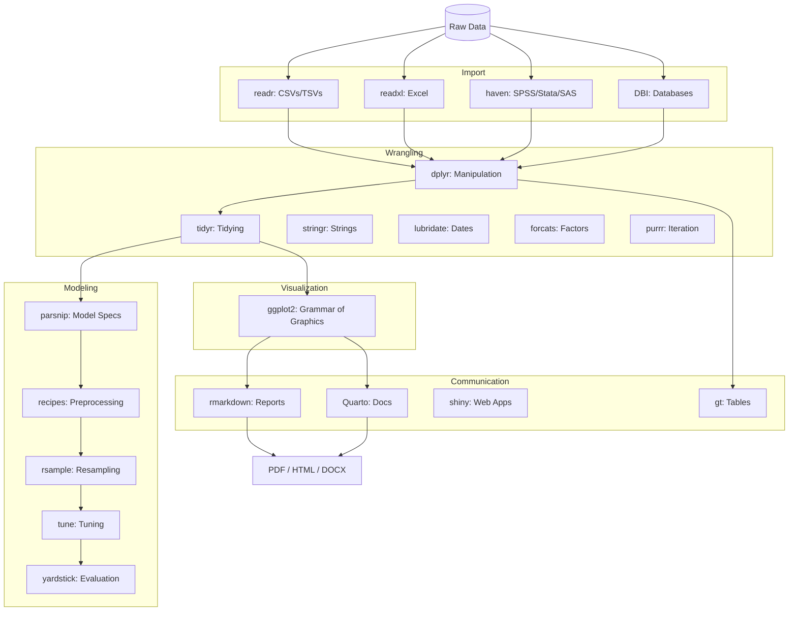

# 01 — Getting Started with R

## Why R?

| Strength | Description |
|----------|-------------|
| Statistics | Born for it — built-in distributions, tests, models |
| Visualization | ggplot2 is the gold standard |
| Reproducible research | R Markdown, Quarto |
| Package ecosystem | CRAN (20K+ packages) |
| Data wrangling | dplyr, tidyr — intuitive pipeline |

## Tidyverse

```r
library(tidyverse)

# Data pipeline
result <- data %>%
    filter(status == "active") %>%
    mutate(age_group = cut(age, breaks = c(0, 18, 35, 50, 100))) %>%
    group_by(age_group, region) %>%
    summarise(
        count = n(),
        avg_amount = mean(amount, na.rm = TRUE),
        .groups = "drop"
    ) %>%
    arrange(desc(count))
```

## Data Visualization (ggplot2)

```r
library(ggplot2)

ggplot(data, aes(x = age, y = income, color = region)) +
    geom_point(alpha = 0.5) +
    geom_smooth(method = "lm", se = TRUE) +
    labs(title = "Income vs Age by Region", x = "Age", y = "Annual Income") +
    theme_minimal() +
    facet_wrap(~region)
```

## Statistical Modeling

```r
# Linear regression
model <- lm(income ~ age + education + region, data = data)
summary(model)

# Logistic regression
model <- glm(churn ~ tenure + contract_type + monthly_charges,
             data = data, family = binomial)
predictions <- predict(model, new_data, type = "response")

# Mixed effects
library(lme4)
model <- lmer(score ~ treatment + (1 | subject), data = data)
```

## R Markdown

```markdown
---
title: "Analysis Report"
output: html_document
---

## Data Summary

```{r}
summary(data)
```

## Model Results
The model shows a significant effect of treatment (p < 0.01).
```

## vs Python for Data Science

| Aspect | R | Python |
|--------|---|--------|
| Statistics | Better built-in | Needs libraries |
| Visualization | ggplot2 (superior) | matplotlib/seaborn |
| ML/DL | caret, tidymodels | scikit-learn, PyTorch |
| Production | Harder | Easier |
| Data exploration | Better (interactive) | Good |
| Ecosystem | CRAN | PyPI |

## Tidyverse Ecosystem Map



## Common Packages

| Package | Purpose |
|---------|---------|
| dplyr | Data manipulation |
| tidyr | Data tidying |
| ggplot2 | Visualization |
| lubridate | Date/time handling |
| stringr | String operations |
| purrr | Functional programming |
| shiny | Interactive web apps |
| data.table | Fast data operations |
| caret | ML training framework |
| rmarkdown | Reproducible reports |

**Links**: [[Web-Dev/Programming/R for Data Science/02 Data Import]] | [[Web-Dev/Programming/R for Data Science/03 Data Wrangling (dplyr)]] | [[Web-Dev/Programming/R for Data Science/05 Visualization (ggplot2)]]
**See also**: [[Pandas for Data Analysis]], [[scikit-learn/_MOC]]
