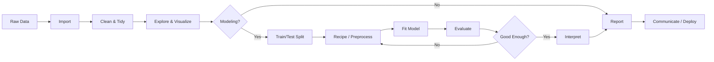

# 11 — Quick Reference

## R Package Quick Reference

| Package | Category | Key Functions |
|---------|----------|--------------|
| dplyr | Wrangling | `filter()`, `mutate()`, `group_by()`, `summarise()`, `arrange()`, `select()`, `slice()` |
| tidyr | Tidying | `pivot_longer()`, `pivot_wider()`, `separate()`, `unite()`, `nest()`, `unnest()` |
| ggplot2 | Viz | `ggplot()`, `geom_*()`, `facet_*()`, `scale_*()`, `theme()`, `labs()`, `ggsave()` |
| readr | Import | `read_csv()`, `read_tsv()`, `read_delim()`, `write_csv()`, `write_rds()` |
| stringr | Strings | `str_detect()`, `str_replace()`, `str_extract()`, `str_split()` |
| lubridate | Dates | `ymd()`, `mdy()`, `floor_date()`, `interval()`, `as.period()` |
| forcats | Factors | `fct_reorder()`, `fct_lump()`, `fct_infreq()`, `fct_relevel()` |
| purrr | Iteration | `map()`, `map2()`, `pmap()`, `walk()`, `keep()`, `safely()` |
| rmarkdown | Reports | `render()`, `html_document()`, `pdf_document()`, `word_document()` |
| shiny | Web Apps | `fluidPage()`, `reactive()`, `renderPlot()`, `observeEvent()` |
| data.table | Performance | `fread()`, `fwrite()`, `setkey()`, `.SD`, `:=` |
| tidymodels | ML | `recipe()`, `workflow()`, `tune_grid()`, `last_fit()`, `collect_metrics()` |

## The Data Science Workflow

**Links**: [[Web-Dev/Programming/R for Data Science/01 Getting Started]] | [[Web-Dev/Programming/R for Data Science/08 Reports (R Markdown & Quarto)]] | [[Web-Dev/Programming/R for Data Science/10 Shiny & Tables]]
**See also**: [[Data Science Workflow]], [[Pandas for Data Analysis]]
