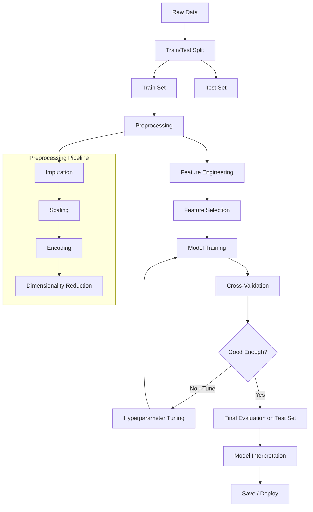
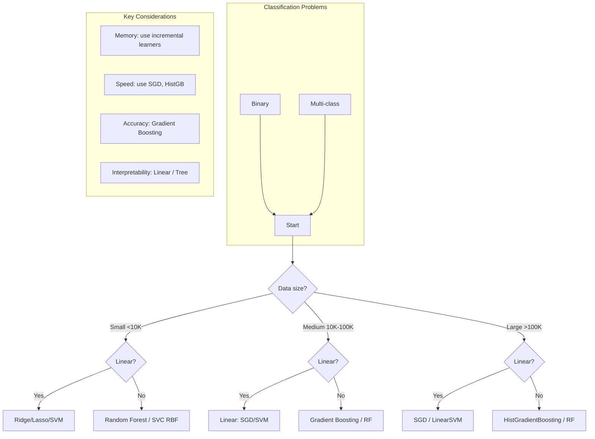

# scikit-learn Deep Dive

scikit-learn is the foundational Python library for classical machine learning, providing unified APIs for preprocessing, modeling, evaluation, and pipelines.

## API Design

```python
# Consistent API across all estimators:
estimator.fit(X, y)       # Train model
estimator.predict(X)      # Make predictions
estimator.transform(X)    # Transform data
estimator.score(X, y)     # Evaluate
estimator.get_params()    # Get hyperparameters
estimator.set_params()    # Set hyperparameters
```

## Preprocessing

```python
from sklearn.preprocessing import (
    StandardScaler, MinMaxScaler, RobustScaler,
    OneHotEncoder, LabelEncoder, OrdinalEncoder,
    PolynomialFeatures, KBinsDiscretizer
)
from sklearn.impute import SimpleImputer
from sklearn.feature_extraction.text import CountVectorizer, TfidfVectorizer
from sklearn.feature_selection import SelectKBest, chi2, RFE

# Scaling
scaler = StandardScaler()                    # Mean=0, std=1 (for SVM, linear models)
scaler = MinMaxScaler()                       # Range [0,1] (for neural networks)
scaler = RobustScaler()                       # Median-based (outlier-robust)

X_scaled = scaler.fit_transform(X)

# Encoding
encoder = OneHotEncoder(sparse_output=False, handle_unknown='ignore')
encoded = encoder.fit_transform(df[['city', 'state']])

# Text features
vectorizer = TfidfVectorizer(max_features=5000, stop_words='english', ngram_range=(1, 2))
X_text = vectorizer.fit_transform(texts)
```

## Classification

```python
from sklearn.linear_model import LogisticRegression
from sklearn.svm import SVC
from sklearn.ensemble import RandomForestClassifier, GradientBoostingClassifier
from sklearn.tree import DecisionTreeClassifier
from sklearn.neighbors import KNeighborsClassifier
from sklearn.naive_bayes import GaussianNB

# Logistic Regression
model = LogisticRegression(C=1.0, solver='lbfgs', max_iter=1000)
model.fit(X_train, y_train)
y_pred = model.predict(X_test)
y_prob = model.predict_proba(X_test)          # Class probabilities

# SVM
model = SVC(kernel='rbf', C=1.0, gamma='scale', probability=True)

# Random Forest
model = RandomForestClassifier(
    n_estimators=200, max_depth=10,
    min_samples_split=5, class_weight='balanced'
)
```

## Regression

```python
from sklearn.linear_model import LinearRegression, Ridge, Lasso, ElasticNet
from sklearn.ensemble import RandomForestRegressor, GradientBoostingRegressor

# Linear with regularization
model = Ridge(alpha=1.0)                       # L2 regularization
model = Lasso(alpha=0.1)                       # L1 (feature selection)
model = ElasticNet(alpha=0.1, l1_ratio=0.5)    # L1 + L2

# Non-linear
model = RandomForestRegressor(n_estimators=200, max_depth=15)
model = GradientBoostingRegressor(n_estimators=300, learning_rate=0.05)
```

## Clustering

```python
from sklearn.cluster import KMeans, DBSCAN, AgglomerativeClustering
from sklearn.mixture import GaussianMixture
from sklearn.metrics import silhouette_score

# K-Means
kmeans = KMeans(n_clusters=5, random_state=42, n_init='auto')
labels = kmeans.fit_predict(X)
centroids = kmeans.cluster_centers_

# Find optimal k
scores = []
for k in range(2, 11):
    kmeans = KMeans(n_clusters=k, random_state=42, n_init='auto')
    labels = kmeans.fit_predict(X)
    scores.append(silhouette_score(X, labels))

# DBSCAN (density-based, finds arbitrary shapes)
dbscan = DBSCAN(eps=0.5, min_samples=5)
labels = dbscan.fit_predict(X)
```

## Dimensionality Reduction

```python
from sklearn.decomposition import PCA, TruncatedSVD
from sklearn.manifold import TSNE

# PCA (linear, for visualization and denoising)
pca = PCA(n_components=2)
X_2d = pca.fit_transform(X)
explained_variance = pca.explained_variance_ratio_

# t-SNE (non-linear, for visualization only)
tsne = TSNE(n_components=2, perplexity=30, random_state=42)
X_tsne = tsne.fit_transform(X)
```

## Model Selection

```python
from sklearn.model_selection import (
    train_test_split, cross_val_score,
    GridSearchCV, RandomizedSearchCV,
    StratifiedKFold, learning_curve
)

# Train/test split
X_train, X_test, y_train, y_test = train_test_split(
    X, y, test_size=0.2, random_state=42, stratify=y
)

# Cross-validation
scores = cross_val_score(model, X, y, cv=5, scoring='f1_macro')
print(f"CV score: {scores.mean():.3f} ± {scores.std():.3f}")

# Grid search
param_grid = {
    'n_estimators': [100, 200, 300],
    'max_depth': [5, 10, 15, None],
    'min_samples_split': [2, 5, 10],
}
grid_search = GridSearchCV(
    RandomForestClassifier(),
    param_grid,
    cv=5,
    scoring='f1',
    n_jobs=-1,
    verbose=1
)
grid_search.fit(X_train, y_train)
print(f"Best params: {grid_search.best_params_}")
print(f"Best score: {grid_search.best_score_:.3f}")

# Randomized search (faster for large spaces)
random_search = RandomizedSearchCV(
    model, param_distributions, n_iter=50, cv=5, random_state=42
)
```

## Evaluation Metrics

```python
from sklearn.metrics import (
    accuracy_score, precision_score, recall_score, f1_score,
    confusion_matrix, classification_report, roc_auc_score, roc_curve,
    mean_squared_error, mean_absolute_error, r2_score
)

# Classification
print(classification_report(y_test, y_pred))

# Confusion matrix
cm = confusion_matrix(y_test, y_pred)

# ROC AUC
y_prob = model.predict_proba(X_test)[:, 1]
auc = roc_auc_score(y_test, y_prob)

# Regression
mse = mean_squared_error(y_test, y_pred)
rmse = mean_squared_error(y_test, y_pred, squared=False)
mae = mean_absolute_error(y_test, y_pred)
r2 = r2_score(y_test, y_pred)
```

## Pipelines

```python
from sklearn.pipeline import Pipeline, make_pipeline
from sklearn.compose import ColumnTransformer

# Simple pipeline
pipeline = Pipeline([
    ('scaler', StandardScaler()),
    ('pca', PCA(n_components=10)),
    ('classifier', LogisticRegression()),
])
pipeline.fit(X_train, y_train)
y_pred = pipeline.predict(X_test)

# Column transformer (mixed types)
numeric_features = ['age', 'salary', 'experience']
categorical_features = ['city', 'department', 'role']

preprocessor = ColumnTransformer([
    ('num', StandardScaler(), numeric_features),
    ('cat', OneHotEncoder(handle_unknown='ignore'), categorical_features),
])

full_pipeline = Pipeline([
    ('preprocessor', preprocessor),
    ('classifier', RandomForestClassifier()),
])

# Use in GridSearch
param_grid = {
    'classifier__n_estimators': [100, 200],
    'classifier__max_depth': [5, 10],
}
grid = GridSearchCV(full_pipeline, param_grid, cv=5)
```

## Persistence

```python
import joblib

# Save
joblib.dump(model, 'model.pkl')
joblib.dump(pipeline, 'pipeline.pkl')

# Load
model = joblib.load('model.pkl')
pipeline = joblib.load('pipeline.pkl')

## ML Workflow Diagram



## Train/Test Split Strategies

```python
from sklearn.model_selection import (
    train_test_split,
    StratifiedShuffleSplit,
    GroupShuffleSplit,
    TimeSeriesSplit,
)

# Standard random split
X_train, X_test, y_train, y_test = train_test_split(
    X, y, test_size=0.2, random_state=42
)

# Stratified split (preserve class proportions)
X_train, X_test, y_train, y_test = train_test_split(
    X, y, test_size=0.2, random_state=42, stratify=y
)

# Group split (keep groups together)
group_split = GroupShuffleSplit(n_splits=1, test_size=0.2, random_state=42)
train_idx, test_idx = next(group_split.split(X, y, groups=df['customer_id']))
X_train, X_test = X[train_idx], X[test_idx]

# Time-based split (no data leakage)
split_idx = int(len(X) * 0.8)
X_train, X_test = X[:split_idx], X[split_idx:]
y_train, y_test = y[:split_idx], y[split_idx:]

# Manual stratified split for multi-label
from sklearn.model_selection import StratifiedShuffleSplit
sss = StratifiedShuffleSplit(n_splits=1, test_size=0.2, random_state=42)
for train_idx, test_idx in sss.split(X, y):
    X_train, X_test = X[train_idx], X[test_idx]
    y_train, y_test = y[train_idx], y[test_idx]
```

## Cross-Validation Strategies

```python
from sklearn.model_selection import (
    KFold,
    StratifiedKFold,
    GroupKFold,
    RepeatedKFold,
    LeaveOneOut,
    LeavePOut,
    ShuffleSplit,
    TimeSeriesSplit,
)

# K-Fold
kf = KFold(n_splits=5, shuffle=True, random_state=42)
for fold, (train_idx, val_idx) in enumerate(kf.split(X), 1):
    X_tr, X_val = X[train_idx], X[val_idx]
    # Train and evaluate

# Stratified K-Fold (maintain class ratio per fold)
skf = StratifiedKFold(n_splits=5, shuffle=True, random_state=42)

# Group K-Fold (groups never split across folds)
gkf = GroupKFold(n_splits=5)
for train_idx, val_idx in gkf.split(X, y, groups=df['patient_id']):
    pass

# Repeated K-Fold
rkf = RepeatedKFold(n_splits=5, n_repeats=10, random_state=42)

# Leave-One-Out (small datasets)
loo = LeaveOneOut()

# Time Series Split (expanding window)
tscv = TimeSeriesSplit(
    n_splits=5,
    max_train_size=1000,  # Limit training window size
    test_size=100,        # Fixed test size
)
for train_idx, val_idx in tscv.split(X):
    print(f"Train: {train_idx[0]}-{train_idx[-1]}, Test: {val_idx[0]}-{val_idx[-1]}")

# Custom CV with scoring
from sklearn.model_selection import cross_validate
scoring = {
    'accuracy': 'accuracy',
    'f1': 'f1_macro',
    'roc_auc': 'roc_auc_ovo',
}
cv_results = cross_validate(
    model, X, y,
    cv=StratifiedKFold(5),
    scoring=scoring,
    return_train_score=True,
    return_estimator=True,
)
print(f"F1: {cv_results['test_f1'].mean():.3f} +/- {cv_results['test_f1'].std():.3f}")

# StratifiedGroupKFold (sklearn >= 1.4)
from sklearn.model_selection import StratifiedGroupKFold
sgkf = StratifiedGroupKFold(n_splits=5)
```

## Feature Engineering

```python
from sklearn.preprocessing import (
    PolynomialFeatures,
    SplineTransformer,
    KBinsDiscretizer,
    QuantileTransformer,
    PowerTransformer,
    FunctionTransformer,
    LabelBinarizer,
    MultiLabelBinarizer,
)
from sklearn.feature_extraction.text import (
    CountVectorizer,
    TfidfVectorizer,
    TfidfTransformer,
    HashingVectorizer,
)

# Polynomial features (interactions + powers)
poly = PolynomialFeatures(
    degree=2,
    interaction_only=False,
    include_bias=True,
)
X_poly = poly.fit_transform(X)
print(poly.get_feature_names_out())

# Spline transformation (non-linear encoding)
spline = SplineTransformer(
    n_knots=5,
    degree=3,        # Cubic splines
    extrapolation='constant',
)
X_spline = spline.fit_transform(X[['age']])

# Discretization (binning)
disc = KBinsDiscretizer(
    n_bins=5,
    encode='ordinal',      # ordinal, onehot-dense, onehot
    strategy='quantile',   # uniform, quantile, kmeans
)
X_binned = disc.fit_transform(X[['age']])

# Power transform (make data more Gaussian)
pt = PowerTransformer(method='yeo-johnson')  # or 'box-cox'
X_transformed = pt.fit_transform(X)

# Quantile transform (maps to uniform/normal)
qt = QuantileTransformer(n_quantiles=1000, output_distribution='normal')
X_uniform = qt.fit_transform(X)

# Custom function transformer
def add_interaction(X):
    if X.shape[1] >= 2:
        interaction = X[:, 0:1] * X[:, 1:2]
        return np.hstack([X, interaction])
    return X

ft = FunctionTransformer(add_interaction, validate=True)
X_with_interaction = ft.fit_transform(X)
```

## Feature Selection

```python
from sklearn.feature_selection import (
    SelectKBest,
    SelectPercentile,
    SelectFromModel,
    RFE,
    RFECV,
    SequentialFeatureSelector,
    VarianceThreshold,
    chi2,
    f_classif,
    mutual_info_classif,
    f_regression,
    mutual_info_regression,
)

# Variance threshold (remove constant features)
selector = VarianceThreshold(threshold=0.01)  # Remove near-zero variance
X_high_var = selector.fit_transform(X)

# Univariate selection
selector = SelectKBest(score_func=f_classif, k=20)
X_selected = selector.fit_transform(X, y)
print(selector.scores_)

# Percentile-based
selector = SelectPercentile(score_func=mutual_info_classif, percentile=25)
X_selected = selector.fit_transform(X, y)

# Recursive Feature Elimination
rfe = RFE(
    estimator=RandomForestClassifier(n_estimators=100, random_state=42),
    n_features_to_select=15,
    step=1,  # Remove 1 feature per iteration
    verbose=1,
)
rfe.fit(X, y)
print(rfe.support_, rfe.ranking_)

# RFE with Cross-Validation (auto-select k)
rfecv = RFECV(
    estimator=LogisticRegression(max_iter=1000),
    step=1,
    cv=StratifiedKFold(5),
    scoring='f1',
    min_features_to_select=5,
)
rfecv.fit(X, y)
print(f"Optimal features: {rfecv.n_features_}")
print(f"Feature ranking: {rfecv.ranking_}")

# SelectFromModel (feature importance based)
selector = SelectFromModel(
    estimator=RandomForestClassifier(n_estimators=200, random_state=42),
    threshold='mean',      # 'median', or numeric value
    max_features=20,
)
selector.fit(X, y)
X_selected = selector.transform(X)

# Sequential Feature Selector (forward/backward)
sfs = SequentialFeatureSelector(
    estimator=RandomForestClassifier(n_estimators=100, random_state=42),
    n_features_to_select=15,
    direction='forward',   # 'backward' also available
    cv=5,
    scoring='f1',
    n_jobs=-1,
)
sfs.fit(X, y)
print(sfs.get_support())
```

## Imputation Strategies

```python
from sklearn.impute import SimpleImputer, KNNImputer, IterativeImputer

# Simple imputation
simp_mean = SimpleImputer(strategy='mean')
simp_median = SimpleImputer(strategy='median')
simp_most_freq = SimpleImputer(strategy='most_frequent')
simp_constant = SimpleImputer(strategy='constant', fill_value=-1)

X_imputed = simp_mean.fit_transform(X)

# KNN imputation (uses similarity between samples)
knn_imputer = KNNImputer(
    n_neighbors=5,
    weights='distance',  # 'uniform' or 'distance'
    metric='nan_euclidean',
)
X_knn = knn_imputer.fit_transform(X)

# Iterative imputation (MICE-like — models each feature with missing values)
iter_imputer = IterativeImputer(
    estimator=RandomForestRegressor(n_estimators=100, random_state=42),
    max_iter=10,
    tol=1e-3,
    imputation_order='ascending',  # ascending, descending, roman, arabic, random
    random_state=42,
)
X_iter = iter_imputer.fit_transform(X)

# ColumnTransformer with different impute strategies
from sklearn.compose import ColumnTransformer

numeric_features = ['age', 'income', 'experience']
categorical_features = ['city', 'region']

preprocessor = ColumnTransformer([
    ('num_median', SimpleImputer(strategy='median'), numeric_features),
    ('num_knn', KNNImputer(n_neighbors=3), ['other_num_col']),
    ('cat_mode', SimpleImputer(strategy='most_frequent'), categorical_features),
])
```

## Ensemble Methods Deep

```python
from sklearn.ensemble import (
    VotingClassifier,
    VotingRegressor,
    BaggingClassifier,
    BaggingRegressor,
    StackingClassifier,
    StackingRegressor,
    RandomForestClassifier,
    ExtraTreesClassifier,
    GradientBoostingClassifier,
    HistGradientBoostingClassifier,
    AdaBoostClassifier,
)

# Voting ensemble (hard = majority, soft = probability avg)
voting = VotingClassifier(
    estimators=[
        ('lr', LogisticRegression(max_iter=1000)),
        ('rf', RandomForestClassifier(n_estimators=200, random_state=42)),
        ('svm', SVC(probability=True, random_state=42)),
    ],
    voting='soft',       # 'hard' for class labels
    weights=[1, 2, 1],   # Weight each classifier
    flatten_transform=True,
)
voting.fit(X_train, y_train)
print(voting.score(X_test, y_test))

# Bagging (bootstrap aggregating)
bagging = BaggingClassifier(
    estimator=DecisionTreeClassifier(max_depth=5),
    n_estimators=200,
    max_samples=0.8,       # Sample 80% of data per estimator
    max_features=0.7,      # Use 70% of features per estimator
    bootstrap=True,
    bootstrap_features=False,
    oob_score=True,        # Out-of-bag score
    random_state=42,
    n_jobs=-1,
)
bagging.fit(X_train, y_train)
print(f"OOB Score: {bagging.oob_score_:.3f}")

# Stacking (meta-learner)
stacking = StackingClassifier(
    estimators=[
        ('rf', RandomForestClassifier(n_estimators=100, random_state=42)),
        ('xgb', GradientBoostingClassifier(n_estimators=100, random_state=42)),
        ('svm', SVC(probability=True, random_state=42)),
    ],
    final_estimator=LogisticRegression(max_iter=1000),
    cv=5,                  # Cross-validation for training meta-features
    stack_method='predict_proba',  # 'auto', 'predict_proba', 'decision_function', 'predict'
    n_jobs=-1,
    passthrough=False,     # If True, also pass original features to meta-learner
)
stacking.fit(X_train, y_train)

# HistGradientBoosting (fast, handles NaN natively, categorical support)
hgb = HistGradientBoostingClassifier(
    max_iter=500,
    max_leaf_nodes=31,
    learning_rate=0.05,
    categorical_features=[0, 5],  # Column indices of categorical features
    early_stopping=True,
    scoring='loss',
    validation_fraction=0.1,
    n_iter_no_change=10,
    random_state=42,
)
hgb.fit(X_train, y_train)

# ExtraTrees (extra-randomized trees)
et = ExtraTreesClassifier(
    n_estimators=500,
    max_features='sqrt',
    min_samples_leaf=2,
    oob_score=True,
    random_state=42,
    n_jobs=-1,
)
```

## Model Calibration

```python
from sklearn.calibration import CalibratedClassifierCV

# Calibrate a model that outputs decision function (e.g., SVM)
svm = SVC(C=1.0, gamma='scale', random_state=42)
calibrated_svm = CalibratedClassifierCV(
    estimator=svm,
    method='isotonic',    # 'sigmoid' (Platt scaling) or 'isotonic'
    cv=5,                 # Cross-validation for calibration
    ensemble=True,        # Average the calibrated classifiers
)
calibrated_svm.fit(X_train, y_train)

# Compare calibrated probabilities
y_prob = calibrated_svm.predict_proba(X_test)

# Calibration curve
from sklearn.calibration import calibration_curve
import matplotlib.pyplot as plt

prob_true, prob_pred = calibration_curve(
    y_test, y_prob[:, 1], n_bins=10, strategy='uniform'
)

plt.plot(prob_pred, prob_true, marker='o', label='Calibrated SVM')
plt.plot([0, 1], [0, 1], linestyle='--', label='Perfect Calibration')
plt.xlabel('Mean Predicted Probability')
plt.ylabel('Fraction of Positives')
plt.legend()
plt.title('Calibration Curve')
```

## Multi-Label and Multi-Output

```python
from sklearn.multioutput import (
    MultiOutputClassifier,
    MultiOutputRegressor,
    ClassifierChain,
    RegressorChain,
)
from sklearn.multiclass import (
    OneVsRestClassifier,
    OneVsOneClassifier,
    OutputCodeClassifier,
)

# Multi-label classification (multiple binary labels per sample)
# y has shape (n_samples, n_labels)
multi_label_clf = MultiOutputClassifier(
    estimator=RandomForestClassifier(n_estimators=200, random_state=42),
    n_jobs=-1,
)
multi_label_clf.fit(X_train, y_train_multi)
y_pred_multi = multi_label_clf.predict(X_test)

# Classifier chains (labels depend on each other)
chain = ClassifierChain(
    base_estimator=LogisticRegression(max_iter=1000),
    order='random',       # Chain order
    random_state=42,
)
chain.fit(X_train, y_train_multi)

# One-vs-Rest
ovr = OneVsRestClassifier(
    estimator=SVC(kernel='rbf', probability=True, random_state=42),
    n_jobs=-1,
)
ovr.fit(X_train, y_train)

# One-vs-One
ovo = OneVsOneClassifier(
    estimator=SVC(kernel='rbf', random_state=42),
)
ovo.fit(X_train, y_train)

# Multi-output regression (multiple continuous targets)
multi_output_rg = MultiOutputRegressor(
    RandomForestRegressor(n_estimators=100, random_state=42)
)
multi_output_rg.fit(X_train, y_train_multi_target)
```

## Anomaly Detection

```python
from sklearn.ensemble import IsolationForest
from sklearn.neighbors import LocalOutlierFactor
from sklearn.covariance import EllipticEnvelope
from sklearn.svm import OneClassSVM
from sklearn.metrics import classification_report

# Isolation Forest (tree-based, good for high-dimensional)
iso_forest = IsolationForest(
    n_estimators=200,
    max_samples='auto',
    contamination='auto',  # Estimate contamination, or float
    random_state=42,
    bootstrap=False,
    n_jobs=-1,
)
outliers_if = iso_forest.fit_predict(X)  # -1 = outlier, 1 = inlier
score_if = iso_forest.decision_function(X)  # Anomaly score (lower = more anomalous)

# Adjust contamination
iso_forest = IsolationForest(contamination=0.05, random_state=42)
outliers_if = iso_forest.fit_predict(X)

# Local Outlier Factor (density-based)
lof = LocalOutlierFactor(
    n_neighbors=20,
    contamination=0.05,
    novel= True,       # For predict on new data
)
outliers_lof = lof.fit_predict(X)
lof_scores = lof.negative_outlier_factor_  # More negative = more anomalous

# LOF with predict on new data
lof = LocalOutlierFactor(novelty=True)
lof.fit(X_train)
outliers_lof_test = lof.predict(X_test)

# Elliptic Envelope (assumes Gaussian distribution)
ee = EllipticEnvelope(
    contamination=0.05,
    random_state=42,
    assume_centered=False,
    support_fraction=0.7,  # Proportion of points to include
)
outliers_ee = ee.fit_predict(X)

# One-Class SVM
ocsvm = OneClassSVM(
    kernel='rbf',
    gamma='scale',
    nu=0.05,            # Upper bound on fraction of outliers
    tol=1e-4,
)
outliers_ocsvm = ocsvm.fit_predict(X)

# Combining anomaly detectors
from sklearn.ensemble import VotingClassifier

# Custom voting for anomaly (most detectors agree)
# (Note: classifiers convert to -1/1 convention)
```

## Manifold Learning

```python
from sklearn.manifold import TSNE, Isomap, LocallyLinearEmbedding, MDS

# t-SNE (non-linear, for visualization — not for feature extraction)
tsne = TSNE(
    n_components=2,
    perplexity=30,        # Balance between local and global structure
    early_exaggeration=12,
    learning_rate='auto',
    n_iter=1000,
    n_iter_without_progress=300,
    min_grad_norm=1e-7,
    metric='euclidean',
    init='random',
    random_state=42,
)
X_tsne = tsne.fit_transform(X)

# Isomap (geodesic distances, preserves global structure)
isomap = Isomap(
    n_components=2,
    n_neighbors=5,        # Neighborhood size
    radius=None,          # Alternative to n_neighbors
    eigen_solver='auto',
    tol=0,
    max_iter=None,
    path_method='auto',
    neighbors_algorithm='auto',
    p=2,                  # Minkowski metric (2 = Euclidean)
)
X_isomap = isomap.fit_transform(X)
print(f"Reconstruction error: {isomap.reconstruction_error():.4f}")

# Locally Linear Embedding (local relationships preserved)
lle = LocallyLinearEmbedding(
    n_components=2,
    n_neighbors=10,
    method='standard',    # 'standard', 'hessian', 'modified', 'ltsa'
    eigen_solver='auto',
    random_state=42,
)
X_lle = lle.fit_transform(X)

# MDS (Multi-Dimensional Scaling)
mds = MDS(
    n_components=2,
    metric=True,           # Non-metric if False
    n_init=4,
    max_iter=300,
    dissimilarity='euclidean',
    random_state=42,
    normalized_stress='auto',
)
X_mds = mds.fit_transform(X)

# UMAP (requires umap-learn package)
# import umap
# reducer = umap.UMAP(n_neighbors=15, min_dist=0.1, random_state=42)
# X_umap = reducer.fit_transform(X)

# Plotting the results
import matplotlib.pyplot as plt

fig, axes = plt.subplots(2, 2, figsize=(12, 10))
methods = [
    (X_tsne, 't-SNE'),
    (X_isomap, 'Isomap'),
    (X_lle, 'LLE'),
    (X_mds, 'MDS'),
]

for ax, (X_emb, title) in zip(axes.ravel(), methods):
    scatter = ax.scatter(X_emb[:, 0], X_emb[:, 1], c=y, cmap='viridis', alpha=0.6, s=10)
    ax.set_title(title)
    ax.set_xlabel('Component 1')
    ax.set_ylabel('Component 2')
    plt.colorbar(scatter, ax=ax)

plt.tight_layout()
```

## Custom Transformers and FunctionTransformer

```python
from sklearn.preprocessing import FunctionTransformer
from sklearn.base import BaseEstimator, TransformerMixin

# FunctionTransformer — wrap arbitrary functions
def log_transform(X):
    return np.log1p(X)  # log(1 + x) to handle zeros

log_transformer = FunctionTransformer(
    func=log_transform,
    inverse_func=np.expm1,
    validate=True,
    feature_names_out='one-to-one',
)

X_log = log_transformer.fit_transform(X)

# Column-specific transformations
def scale_positive(X):
    """MinMax scale only positive columns, leave others."""
    X_out = X.copy()
    for i in range(X.shape[1]):
        if X[:, i].min() >= 0:
            X_out[:, i] = (X[:, i] - X[:, i].min()) / (X[:, i].max() - X[:, i].min())
    return X_out

scale_transformer = FunctionTransformer(scale_positive, validate=True)

# Custom transformer class (for complex logic)
class DateFeatureExtractor(BaseEstimator, TransformerMixin):
    def __init__(self, date_column=0):
        self.date_column = date_column

    def fit(self, X, y=None):
        return self

    def transform(self, X):
        dates = pd.to_datetime(X[:, self.date_column])
        features = np.column_stack([
            dates.year,
            dates.month,
            dates.day,
            dates.dayofweek,
            dates.quarter,
            (dates - pd.Timestamp('2000-01-01')).dt.days,
        ])
        # Drop original date column, add features
        X_out = np.delete(X, self.date_column, axis=1)
        return np.hstack([X_out.astype(float), features.astype(float)])

    def get_feature_names_out(self, input_features=None):
        return ['year', 'month', 'day', 'dayofweek', 'quarter', 'elapsed_days']

# Custom transformer with fit logic
class OutlierClipper(BaseEstimator, TransformerMixin):
    def __init__(self, factor=1.5):
        self.factor = factor

    def fit(self, X, y=None):
        self.lower_bounds_ = np.percentile(X, 25, axis=0) - self.factor * (
            np.percentile(X, 75, axis=0) - np.percentile(X, 25, axis=0))
        self.upper_bounds_ = np.percentile(X, 75, axis=0) + self.factor * (
            np.percentile(X, 75, axis=0) - np.percentile(X, 25, axis=0))
        return self

    def transform(self, X):
        return np.clip(X, self.lower_bounds_, self.upper_bounds_)

# Usage
clipper = OutlierClipper(factor=3.0)
X_clipped = clipper.fit_transform(X)
```

## Imbalanced Data Handling

```python
# Class weighting (built-in)
from sklearn.linear_model import LogisticRegression
from sklearn.svm import SVC
from sklearn.ensemble import RandomForestClassifier

# Automatic class weights
model = RandomForestClassifier(
    class_weight='balanced',  # weights inversely proportional to class frequencies
    random_state=42,
)

# Custom weights
model = LogisticRegression(
    class_weight={0: 1.0, 1: 5.0},  # Penalize misclassifying class 1 more
    max_iter=1000,
)

# Balanced subsample
model = RandomForestClassifier(
    class_weight='balanced_subsample',  # Weights based on bootstrap sample
    random_state=42,
)

# SMOTE (requires imbalanced-learn)
# from imblearn.over_sampling import SMOTE, ADASYN, RandomOverSampler
# from imblearn.under_sampling import RandomUnderSampler, NearMiss
# from imblearn.pipeline import Pipeline as ImbPipeline
# from imblearn.combine import SMOTETomek, SMOTEENN

# # SMOTE oversampling
# smote = SMOTE(random_state=42, k_neighbors=5)
# X_resampled, y_resampled = smote.fit_resample(X_train, y_train)

# # SMOTE + Tomek Links (cleaning)
# smote_tomek = SMOTETomek(random_state=42)
# X_res, y_res = smote_tomek.fit_resample(X_train, y_train)

# # Pipeline with SMOTE
# pipeline = ImbPipeline([
#     ('preprocessor', preprocessor),
#     ('smote', SMOTE(random_state=42)),
#     ('classifier', RandomForestClassifier(random_state=42)),
# ])
# pipeline.fit(X_train, y_train)

# # Evaluate with balanced metrics
# from sklearn.metrics import balanced_accuracy_score, f1_score, precision_recall_curve
# y_pred = pipeline.predict(X_test)
# print(f"Balanced accuracy: {balanced_accuracy_score(y_test, y_pred):.3f}")
# print(f"F1 (macro): {f1_score(y_test, y_pred, average='macro'):.3f}")
```

## Model Interpretability

```python
from sklearn.inspection import (
    permutation_importance,
    partial_dependence,
    PartialDependenceDisplay,
)

# Permutation feature importance (model-agnostic)
result = permutation_importance(
    model, X_test, y_test,
    n_repeats=10,
    random_state=42,
    scoring='f1',              # or 'roc_auc', 'accuracy'
    n_jobs=-1,
)

# Results
importance_df = pd.DataFrame({
    'feature': feature_names,
    'importance_mean': result.importances_mean,
    'importance_std': result.importances_std,
}).sort_values('importance_mean', ascending=False)

print(importance_df.head(10))

# Partial dependence plots (PDP)
features_to_plot = [0, 1, (0, 1)]  # Single features + interaction

PartialDependenceDisplay.from_estimator(
    model, X_train, features_to_plot,
    feature_names=feature_names,
    grid_resolution=20,
    kind='average',              # 'average' or 'individual'
    subsample=1000,              # Use subset for speed
    random_state=42,
    ice_kwargs={'alpha': 0.01, 'linewidth': 0.5},  # Individual Conditional Expectation
)
plt.tight_layout()

# Custom partial dependence on specific features
from sklearn.inspection import partial_dependence

pdp = partial_dependence(
    model, X_train, features=[0, 1],
    kind='average',
    grid_resolution=50,
)

# Feature importance from tree-based models
importances = model.feature_importances_
std = np.std([tree.feature_importances_ for tree in model.estimators_], axis=0)

forest_importances = pd.Series(importances, index=feature_names).sort_values(ascending=False)

fig, ax = plt.subplots(figsize=(10, 8))
forest_importances.head(15).plot.bar(yerr=std[:15], ax=ax)
ax.set_title("Feature Importance")
ax.set_ylabel("Mean Decrease in Impurity")
fig.tight_layout()

# For linear models (coefficients)
coef_df = pd.DataFrame({
    'feature': feature_names,
    'coefficient': model.coef_[0],
}).sort_values('coefficient', ascending=False)

print(coef_df)
```

## Advanced Pipeline Techniques

```python
from sklearn.pipeline import Pipeline, make_pipeline, FeatureUnion
from sklearn.compose import ColumnTransformer, make_column_transformer

# Pipeline with memory caching
from tempfile import mkdtemp
cachedir = mkdtemp()

pipeline = Pipeline([
    ('preprocessor', preprocessor),
    ('classifier', RandomForestClassifier(random_state=42)),
], memory=cachedir)  # Cache transform steps — reuses if input unchanged

# FeatureUnion (combine multiple feature extraction pipelines)
feature_union = FeatureUnion([
    ('numeric_pipeline', Pipeline([
        ('impute', SimpleImputer(strategy='median')),
        ('scale', StandardScaler()),
        ('poly', PolynomialFeatures(degree=2, include_bias=False)),
    ])),
    ('text_pipeline', Pipeline([
        ('vectorizer', TfidfVectorizer(max_features=5000)),
        ('svd', TruncatedSVD(n_components=50)),
    ])),
])

# Deep ColumnTransformer example
preprocessor = ColumnTransformer(
    transformers=[
        # Numeric pipeline
        ('num', Pipeline([
            ('impute', SimpleImputer(strategy='median')),
            ('scale', StandardScaler()),
            ('poly', PolynomialFeatures(degree=2, interaction_only=True, include_bias=False)),
        ]), ['age', 'income', 'experience']),

        # Categorical pipeline
        ('cat', Pipeline([
            ('impute', SimpleImputer(strategy='constant', fill_value='missing')),
            ('encode', OneHotEncoder(handle_unknown='ignore', sparse_output=False)),
        ]), ['city', 'region', 'department']),

        # Cyclical encoding for time features
        ('time', FunctionTransformer(
            func=lambda X: np.column_stack([
                np.sin(2 * np.pi * X[:, 0] / 12),
                np.cos(2 * np.pi * X[:, 0] / 12),
                np.sin(2 * np.pi * X[:, 1] / 7),
                np.cos(2 * np.pi * X[:, 1] / 7),
            ])
        ), ['month', 'dayofweek']),

        # Pass-through columns
        ('passthrough', 'passthrough', ['id']),
    ],
    remainder='drop',  # Drop columns not specified
    verbose_feature_names_out=False,  # Clean feature names
)

# Nested pipeline with GridSearch
full_pipeline = Pipeline([
    ('preprocessor', preprocessor),
    ('feature_selection', SelectFromModel(
        RandomForestClassifier(n_estimators=100, random_state=42),
        threshold='median',
    )),
    ('classifier', GradientBoostingClassifier(random_state=42)),
])

# Complex grid search with pipeline
param_grid = {
    'preprocessor__num__impute__strategy': ['mean', 'median'],
    'preprocessor__cat__encode__handle_unknown': ['ignore', 'infrequent_if_exist'],
    'feature_selection__estimator__n_estimators': [100, 200],
    'classifier__n_estimators': [100, 300, 500],
    'classifier__max_depth': [3, 5, 7],
    'classifier__learning_rate': [0.01, 0.05, 0.1],
}

grid_search = GridSearchCV(
    full_pipeline,
    param_grid,
    cv=StratifiedKFold(5, shuffle=True, random_state=42),
    scoring='f1_macro',
    n_jobs=-1,
    verbose=2,
    refit=True,
)

grid_search.fit(X_train, y_train)
print(f"Best score: {grid_search.best_score_:.4f}")
print(f"Best params: {grid_search.best_params_}")
```

## Model Selection Extras

```python
from sklearn.model_selection import (
    GridSearchCV,
    RandomizedSearchCV,
    HalvingGridSearchCV,
    HalvingRandomSearchCV,
    ParameterGrid,
    ParameterSampler,
    validation_curve,
    learning_curve,
)

# Halving Grid Search (successive halving)
halving_grid = HalvingGridSearchCV(
    estimator=RandomForestClassifier(random_state=42),
    param_grid={
        'n_estimators': [50, 100, 200, 400],
        'max_depth': [5, 10, 20, None],
        'min_samples_split': [2, 5, 10],
    },
    factor=3,                 # Reduce candidates by factor each iteration
    resource='n_estimators',  # Resource to increase
    max_resources='auto',
    min_resources='smallest',
    aggressive_elimination=False,
    cv=5,
    scoring='f1',
    n_jobs=-1,
)
halving_grid.fit(X_train, y_train)

# Learning curve (diagnose bias/variance)
train_sizes, train_scores, test_scores = learning_curve(
    estimator=RandomForestClassifier(n_estimators=200, random_state=42),
    X=X, y=y,
    train_sizes=np.linspace(0.1, 1.0, 10),
    cv=5,
    scoring='f1',
    n_jobs=-1,
    shuffle=True,
    random_state=42,
)

train_mean = np.mean(train_scores, axis=1)
test_mean = np.mean(test_scores, axis=1)
train_std = np.std(train_scores, axis=1)
test_std = np.std(test_scores, axis=1)

plt.figure(figsize=(10, 6))
plt.plot(train_sizes, train_mean, 'o-', label='Training Score', color='blue')
plt.plot(train_sizes, test_mean, 'o-', label='Cross-Validation Score', color='red')
plt.fill_between(train_sizes, train_mean - train_std, train_mean + train_std, alpha=0.2, color='blue')
plt.fill_between(train_sizes, test_mean - test_std, test_mean + test_std, alpha=0.2, color='red')
plt.xlabel('Training Examples')
plt.ylabel('F1 Score')
plt.title('Learning Curve')
plt.legend()
plt.grid(True)

# Validation curve (effect of a single hyperparameter)
param_range = [1, 3, 5, 10, 20, 50]
train_scores, test_scores = validation_curve(
    estimator=RandomForestClassifier(random_state=42),
    X=X, y=y,
    param_name='max_depth',
    param_range=param_range,
    cv=5,
    scoring='f1',
    n_jobs=-1,
)
```

## Evaluation Metrics Deep

```python
from sklearn.metrics import (
    accuracy_score, balanced_accuracy_score,
    precision_score, recall_score, f1_score,
    precision_recall_fscore_support,
    confusion_matrix, ConfusionMatrixDisplay,
    classification_report,
    roc_curve, roc_auc_score,
    precision_recall_curve,
    average_precision_score,
    matthews_corrcoef,
    cohen_kappa_score,
    log_loss,
    brier_score_loss,
    # Regression
    mean_squared_error, mean_absolute_error,
    r2_score, explained_variance_score,
    mean_absolute_percentage_error,
    max_error,
    # Multi-label
    coverage_error, label_ranking_average_precision_score,
    hamming_loss, jaccard_score,
)

# Detailed classification report
print(classification_report(y_test, y_pred, digits=4))

# Confusion matrix with normalized display
cm = confusion_matrix(y_test, y_pred, normalize='true')
disp = ConfusionMatrixDisplay(cm)
disp.plot(cmap='Blues', values_format='.2f')
plt.title('Normalized Confusion Matrix')

# ROC curve with AUC
fpr, tpr, thresholds_roc = roc_curve(y_test, y_prob[:, 1])
roc_auc = roc_auc_score(y_test, y_prob[:, 1])

plt.figure()
plt.plot(fpr, tpr, label=f'ROC (AUC={roc_auc:.3f})')
plt.plot([0, 1], [0, 1], 'k--')
plt.xlabel('False Positive Rate')
plt.ylabel('True Positive Rate')
plt.title('ROC Curve')
plt.legend()

# Precision-Recall curve (better for imbalanced data)
precision, recall, thresholds_pr = precision_recall_curve(y_test, y_prob[:, 1])
avg_precision = average_precision_score(y_test, y_prob[:, 1])

plt.figure()
plt.plot(recall, precision, label=f'PR (AP={avg_precision:.3f})')
plt.xlabel('Recall')
plt.ylabel('Precision')
plt.title('Precision-Recall Curve')
plt.legend()

# Find optimal threshold (Youden's J)
optimal_idx = np.argmax(tpr - fpr)
optimal_threshold = thresholds_roc[optimal_idx]
print(f"Optimal threshold (Youden): {optimal_threshold:.3f}")

# Matthews Correlation Coefficient (good single metric for binary)
mcc = matthews_corrcoef(y_test, y_pred)
print(f"MCC: {mcc:.4f}")

# Cohen's Kappa
kappa = cohen_kappa_score(y_test, y_pred)
print(f"Cohen's Kappa: {kappa:.4f}")

# Brier score (probability calibration)
brier = brier_score_loss(y_test, y_prob[:, 1])
print(f"Brier Score: {brier:.4f} (lower is better)")

# Regression metrics
mse = mean_squared_error(y_test, y_pred)
rmse = mean_squared_error(y_test, y_pred, squared=False)
mae = mean_absolute_error(y_test, y_pred)
mape = mean_absolute_percentage_error(y_test, y_pred) * 100
r2 = r2_score(y_test, y_pred)
ev = explained_variance_score(y_test, y_pred)

print(f"RMSE: {rmse:.3f}, MAE: {mae:.3f}, MAPE: {mape:.2f}%")
print(f"R²: {r2:.4f}, Explained Var: {ev:.4f}")
```

## Algorithm Selection Guide



| Problem Type | First Try | Tune Toward | If Overfitting |
|-------------|-----------|-------------|----------------|
| Binary classification | LogisticRegression | GradientBoosting, RF | Increase regularization |
| Multi-class | RandomForest | HistGradientBoosting | Reduce max_depth |
| Regression | Ridge | GradientBoostingRegressor | Increase min_samples_leaf |
| High-dimensional | LinearSVM, Lasso | SelectKBest + any model | Increase penalty C |
| Text data | TfidfVectorizer + LinearSVM | FastText, Transformers | ngram_range, max_features |
| Large dataset | SGDClassifier | HistGradientBoosting | Early stopping |
| Imbalanced | class_weight='balanced' | SMOTE + RF | Increase class weight |
| Time series | TimeSeriesSplit + LightGBM | Prophet, N-BEATS | Strict temporal CV |
| Few features | RandomForest | GradientBoosting | Increase n_estimators |
| Many features | Lasso, LinearSVM | RF with max_features='sqrt' | Feature selection |
```

**Links**: [[Async Python]] | [[C and C++]] | [[C Sharp and DotNET]] | [[Compiler Design]] | [[Dart and Flutter]] | [[Elixir and Erlang]] | [[Finite Automata and Formal Languages]] | [[Flutter Deep Dive]] | [[Functional Programming Concepts]] | [[Functional Programming]] | [[Go Concurrency Patterns]] | [[Go Programming]] | [[Haskell]] | [[Java]] | [[Julia]] | [[Kotlin]] | [[Lua Scripting]] | [[Object-Oriented Programming]] | [[Pandas for Data Analysis]] | [[PHP]] | [[Programming Language Paradigms]] | [[Python Deep Dive]] | [[Python Imports and Modules]] | [[Python Type Hints]] | [[Python Virtual Environments]] | [[PyTorch Deep Dive]] | [[R for Data Science]] | [[Ruby]] | [[Rust Ownership and Borrowing]] | [[Rust]] | [[Scala]] | [[Swift and iOS Development]] | [[TypeScript]]
