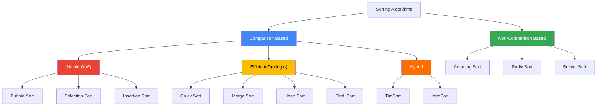
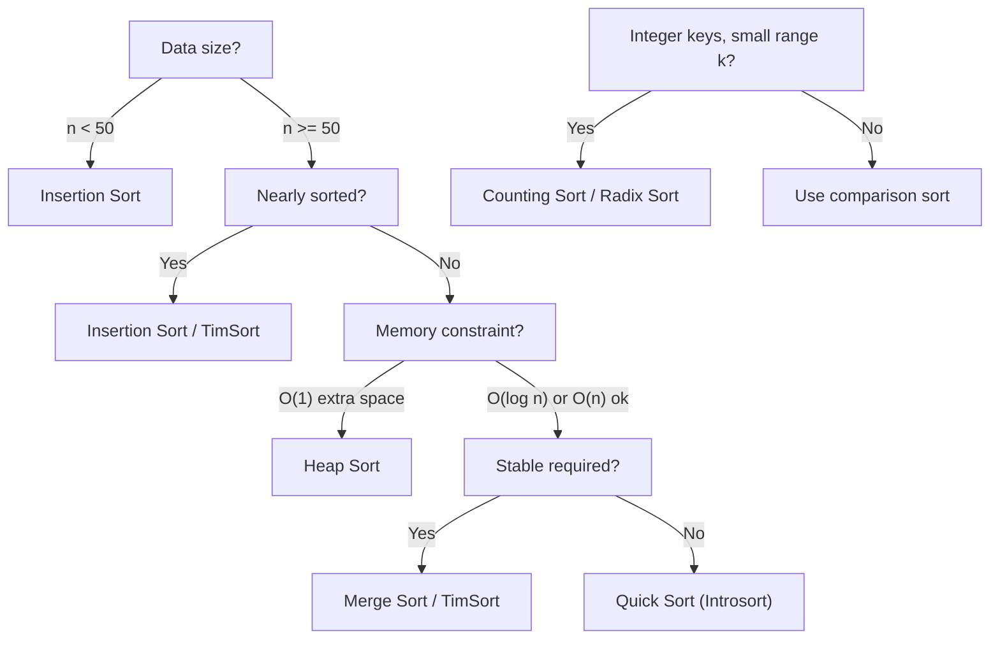

**Links**: [[Web Development Fundamentals]] | [[State Management Patterns]] | [[WebAssembly]] | [[Web Components]] | [[CSS and Styling]] | [[Web Accessibility]]


# Sorting Algorithms

Sorting arranges data in a specified order. Different algorithms trade off speed, memory, and stability.

## Classification



## Comparison-Based

| Algorithm | Best | Average | Worst | Memory | Stable | Adaptive |
|-----------|------|---------|-------|--------|--------|----------|
| Quick Sort | O(n log n) | O(n log n) | O(n²) | O(log n) | No | No |
| Merge Sort | O(n log n) | O(n log n) | O(n log n) | O(n) | Yes | No |
| Heap Sort | O(n log n) | O(n log n) | O(n log n) | O(1) | No | No |
| Bubble Sort | O(n) | O(n²) | O(n²) | O(1) | Yes | Yes |
| Insertion Sort | O(n) | O(n²) | O(n²) | O(1) | Yes | Yes |
| Selection Sort | O(n²) | O(n²) | O(n²) | O(1) | No | No |
| Shell Sort | O(n log n) | O(n^4/3) | O(n^3/2) | O(1) | No | Yes |

## Non-Comparison Based

| Algorithm | Time | Space | Constraint |
|-----------|------|-------|------------|
| Counting Sort | O(n + k) | O(k) | Integer range k |
| Radix Sort (LSD) | O(d × (n + k)) | O(n + k) | Fixed digit length d, base k |
| Radix Sort (MSD) | O(d × (n + k)) | O(n + k) | Variable-length keys |
| Bucket Sort | O(n + k) avg | O(n) | Uniform distribution |

## Detailed Algorithm Explanations

### Bubble Sort
Repeatedly steps through the list, compares adjacent elements, and swaps them if they are in the wrong order. The pass-through continues until no swaps are needed.

```python
def bubble_sort(arr):
    n = len(arr)
    for i in range(n):
        swapped = False
        for j in range(0, n - i - 1):
            if arr[j] > arr[j + 1]:
                arr[j], arr[j + 1] = arr[j + 1], arr[j]
                swapped = True
        if not swapped:
            break
    return arr
```

**Visualization**: `[5, 3, 8, 1] → [3, 5, 1, 8] → [3, 1, 5, 8] → [1, 3, 5, 8]`

### Selection Sort
Divides the array into sorted and unsorted regions. Repeatedly selects the smallest element from the unsorted region and moves it to the end of the sorted region.

```python
def selection_sort(arr):
    for i in range(len(arr)):
        min_idx = i
        for j in range(i + 1, len(arr)):
            if arr[j] < arr[min_idx]:
                min_idx = j
        arr[i], arr[min_idx] = arr[min_idx], arr[i]
    return arr
```

**Visualization**: `[5, 3, 8, 1] → [1, 3, 8, 5] → [1, 3, 8, 5] → [1, 3, 5, 8]`

### Insertion Sort
Builds the final sorted array one element at a time. Each new element is inserted into its correct position relative to already-sorted elements.

```python
def insertion_sort(arr):
    for i in range(1, len(arr)):
        key = arr[i]
        j = i - 1
        while j >= 0 and arr[j] > key:
            arr[j + 1] = arr[j]
            j -= 1
        arr[j + 1] = key
    return arr
```

**Visualization**: `[5, 3, 8, 1] → [3, 5, 8, 1] → [3, 5, 8, 1] → [1, 3, 5, 8]`

### Quick Sort
Picks a pivot element, partitions the array around the pivot so that smaller elements go left and larger go right, then recursively sorts each partition.

```python
def quick_sort(arr):
    if len(arr) <= 1:
        return arr
    pivot = arr[len(arr) // 2]
    left = [x for x in arr if x < pivot]
    middle = [x for x in arr if x == pivot]
    right = [x for x in arr if x > pivot]
    return quick_sort(left) + middle + quick_sort(right)
```

**In-place variant**:
```python
def partition(arr, low, high):
    pivot = arr[high]
    i = low - 1
    for j in range(low, high):
        if arr[j] <= pivot:
            i += 1
            arr[i], arr[j] = arr[j], arr[i]
    arr[i + 1], arr[high] = arr[high], arr[i + 1]
    return i + 1

def quick_sort_inplace(arr, low=0, high=None):
    if high is None:
        high = len(arr) - 1
    if low < high:
        pi = partition(arr, low, high)
        quick_sort_inplace(arr, low, pi - 1)
        quick_sort_inplace(arr, pi + 1, high)
    return arr
```

**Visualization**: `[5, 3, 8, 1] → pivot=8 → [5, 3, 1] + [8] + [] → ... → [1, 3, 5, 8]`

### Merge Sort
Divides the array into two halves, recursively sorts each half, then merges the two sorted halves.

```python
def merge_sort(arr):
    if len(arr) <= 1:
        return arr
    mid = len(arr) // 2
    left = merge_sort(arr[:mid])
    right = merge_sort(arr[mid:])

    result = []
    i = j = 0
    while i < len(left) and j < len(right):
        if left[i] <= right[j]:
            result.append(left[i])
            i += 1
        else:
            result.append(right[j])
            j += 1
    result.extend(left[i:])
    result.extend(right[j:])
    return result
```

**Visualization**: `[5, 3, 8, 1] → [5, 3] + [8, 1] → [3, 5] + [1, 8] → [1, 3, 5, 8]`

### Heap Sort
Builds a max-heap from the array, then repeatedly extracts the largest element (root) and places it at the end of the array.

```python
def heapify(arr, n, i):
    largest = i
    left = 2 * i + 1
    right = 2 * i + 2
    if left < n and arr[left] > arr[largest]:
        largest = left
    if right < n and arr[right] > arr[largest]:
        largest = right
    if largest != i:
        arr[i], arr[largest] = arr[largest], arr[i]
        heapify(arr, n, largest)

def heap_sort(arr):
    n = len(arr)
    for i in range(n // 2 - 1, -1, -1):
        heapify(arr, n, i)
    for i in range(n - 1, 0, -1):
        arr[i], arr[0] = arr[0], arr[i]
        heapify(arr, i, 0)
    return arr
```

**Visualization**: `[5, 3, 8, 1] → build heap [8, 3, 5, 1] → extract 8 → [5, 3, 1, 8] → ... → [1, 3, 5, 8]`

### Shell Sort
Generalization of insertion sort that sorts elements far apart first (h-sort), gradually reducing the gap.

```python
def shell_sort(arr):
    n = len(arr)
    gap = n // 2
    while gap > 0:
        for i in range(gap, n):
            temp = arr[i]
            j = i
            while j >= gap and arr[j - gap] > temp:
                arr[j] = arr[j - gap]
                j -= gap
            arr[j] = temp
        gap //= 2
    return arr
```

### Counting Sort
Counts occurrences of each distinct value, then calculates positions. Only works for integer keys with a known range.

```python
def counting_sort(arr):
    if not arr:
        return arr
    k = max(arr)
    count = [0] * (k + 1)
    for num in arr:
        count[num] += 1
    for i in range(1, len(count)):
        count[i] += count[i - 1]
    output = [0] * len(arr)
    for num in reversed(arr):
        output[count[num] - 1] = num
        count[num] -= 1
    return output
```

### Radix Sort
Processes digits one at a time (LSD or MSD). Uses counting sort as the stable subroutine per digit pass.

```python
def counting_sort_for_radix(arr, exp):
    n = len(arr)
    output = [0] * n
    count = [0] * 10
    for i in range(n):
        index = (arr[i] // exp) % 10
        count[index] += 1
    for i in range(1, 10):
        count[i] += count[i - 1]
    for i in range(n - 1, -1, -1):
        index = (arr[i] // exp) % 10
        output[count[index] - 1] = arr[i]
        count[index] -= 1
    for i in range(n):
        arr[i] = output[i]

def radix_sort(arr):
    if not arr:
        return arr
    max_val = max(arr)
    exp = 1
    while max_val // exp > 0:
        counting_sort_for_radix(arr, exp)
        exp *= 10
    return arr
```

### Bucket Sort
Distributes elements into buckets (based on range), sorts each bucket individually (often with insertion sort), then concatenates.

```python
def bucket_sort(arr):
    if not arr:
        return arr
    n = len(arr)
    buckets = [[] for _ in range(n)]
    for num in arr:
        idx = int(num * n)
        buckets[min(idx, n - 1)].append(num)
    for bucket in buckets:
        insertion_sort(bucket)
    return [num for bucket in buckets for num in bucket]
```

## Stability Explained

A sorting algorithm is **stable** if elements with equal keys maintain their relative order after sorting.

| Algorithm | Stable? | Example |
|-----------|---------|---------|
| Insertion Sort | Yes | `(5,a), (3,b), (5,c)` → `(3,b), (5,a), (5,c)` — relative order of 5's preserved |
| Merge Sort | Yes | Equal elements from left half come before right half |
| Bubble Sort | Yes | Only swaps when strictly greater |
| TimSort | Yes | Inherits stability from merge sort |
| Quick Sort | No | Partition step can swap equal elements out of order |
| Heap Sort | No | Heap operations do not preserve insertion order |
| Selection Sort | No | Swapping the minimum with the current position can reorder equal keys |
| Counting Sort | Yes | Reverse iteration preserves relative order |
| Radix Sort | Yes | Requires stable subroutine per digit |

## Decision Tree — Which Sort to Use?



## External Sorting

When data exceeds available RAM, external sorting uses disk-based techniques:

1. **Sorting Phase**: Read chunks that fit in RAM, sort each chunk (internal sort), write to temporary files.
2. **Merge Phase**: Use a k-way merge to combine sorted runs.

### External Merge Sort
```python
import heapq

def external_sort(input_file, output_file, chunk_size=10000):
    temp_files = []
    with open(input_file, 'r') as f:
        chunk = []
        for line in f:
            chunk.append(int(line.strip()))
            if len(chunk) >= chunk_size:
                chunk.sort()
                tmp = write_temp(chunk)
                temp_files.append(tmp)
                chunk = []
        if chunk:
            chunk.sort()
            tmp = write_temp(chunk)
            temp_files.append(tmp)

    with open(output_file, 'w') as out:
        iterators = [open(f, 'r') for f in temp_files]
        merged = heapq.merge(*[int(x.strip()) for x in it] for it in iterators)
        for val in merged:
            out.write(f"{val}\n")
```

## Real-World Sorting Implementations

| Language / Library | Algorithm | Why |
|-------------------|-----------|-----|
| Python (list.sort, sorted) | TimSort | Stable, O(n) on nearly-sorted, hybrid merge+insertion |
| Java (Arrays.sort) | Dual-Pivot Quick Sort (primitives) / TimSort (objects) | Performance + stability for objects |
| C++ (std::sort) | Introsort (Quick Sort → Heap Sort) | O(n log n) worst-case guarantee |
| Rust (slice::sort) | Adaptive Merge Sort (based on TimSort) | Stable, O(n log n) worst-case |
| Go (sort.Slice) | Pattern-Defeating Quick Sort (pdqsort) | Fast, in-place, detects patterns |
| .NET (Array.Sort) | Introsort | O(n log n) worst-case guarantee |
| JavaScript (Array.sort) | TimSort (V8, SpiderMonkey) | Stable since ES2019 |
| C# (LINQ OrderBy) | Quicksort (stable via secondary index) | Stable by index |
| PostgreSQL (ORDER BY) | External merge sort + TimSort hybrid | Disk-based + in-memory |
| Redis (SORT) | Quick Sort or merge sort depending on data | Simple, small datasets |

## Parallel Sorting

For large-scale sorting across multiple cores or machines:

| Algorithm | Approach | Speedup |
|-----------|----------|---------|
| Parallel Merge Sort | Divide array across cores, merge in parallel | Near-linear for large n |
| Sample Sort | Sampling-based partitioning + local sort | Good for distributed systems |
| GPU Bitonic Sort | O(log² n) depth on GPU | Best for SIMD architectures |
| MapReduce Sort | Shuffle phase = distributed sort by key | Hadoop, Spark default |

## Cross-Domain Links

- [[Big O Notation]] → [[System-Design/Algorithms/_MOC|Algorithms MOC]]
- [[Data Structures]] → [[System-Design/Data-Structures/_MOC|Data Structures MOC]]
- [[Functional Programming]] → [[Web-Dev/Functional Programming]]
- Sorting in databases → [[System-Design/Databases/Database Indexing]], [[System-Design/Databases/Database Sharding]], [[System-Design/Databases/LSM-Tree Storage Engines]]
- Parallel sorting → [[System-Design/Architecture/Concurrency Models]], [[System-Design/Databases/Apache Spark]]
- External sorting → [[System-Design/Databases/Apache Kafka Deep Dive]], [[System-Design/Databases/Stream Processing]]
- [[Web-Dev/Sorting Algorithms]] → [[Web-Dev/_MOC|Web Dev Hub]], [[System-Design/_MOC|System Design Hub]]
