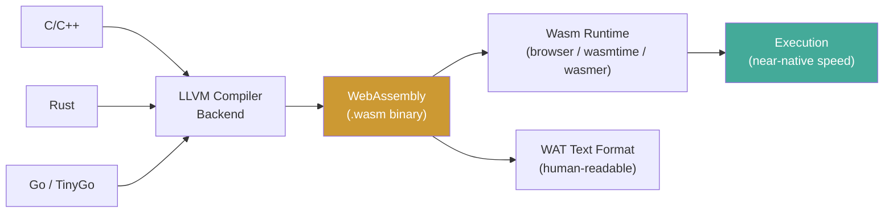

**Links**: [[Web Development Fundamentals]] | [[Web Components]] | [[Web Accessibility]] | [[Web3 and Decentralized Applications]] | [[Desktop Apps with Electron and Tauri]] | [[React]]


# WebAssembly

WebAssembly (Wasm) is a binary instruction format for stack-based virtual machines. It runs at near-native speed in browsers and increasingly on servers.

## Compilation Pipeline



Source languages compile through LLVM to produce `.wasm` binaries. These run in any Wasm runtime — browser, server (WASI), or embedded.

## Key Characteristics

| Feature | Wasm | JavaScript |
|---------|------|------------|
| Format | Binary (`.wasm`) | Text (`.js`) |
| Parsing | Fast (pre-compiled) | Parsed at runtime |
| Performance | Near-native | JIT-compiled |
| Types | Static (i32, i64, f32, f64) | Dynamic |
| Security | Sandboxed, no raw pointers | Sandboxed |

## Wasm vs JS Performance

Wasm excels at:
- CPU-heavy computations (games, image/video processing)
- Porting existing C/C++/Rust libraries
- Scientific computing, cryptography
- 3D rendering, physics simulations

JS still wins for:
- DOM manipulation
- Network I/O
- Business logic with heavy string processing
- Rapid prototyping

## Compilation Targets

| Language | Toolchain | Example Use |
|----------|-----------|-------------|
| C/C++ | Emscripten | Port legacy libraries |
| Rust | wasm-pack | Systems programming for web |
| Go | Go compiler (tinygo) | Web apps |
| C# | Blazor | Full-stack .NET in browser |
| Kotlin | Kotlin/Wasm | Kotlin in browser |
| AssemblyScript | asc | TypeScript-like Wasm |

## Wasm Ecosystem Tools

| Tool | Purpose |
|------|---------|
| **Emscripten** | Compile C/C++ to Wasm with JS glue for DOM/browser APIs |
| **wasm-pack** | Build, optimize, and publish Rust-generated Wasm to npm |
| **wasmtime** | Standalone Wasm runtime for server-side execution (WASI) |
| **wasmer** | Universal Wasm runtime supporting multiple compilation backends |
| **wazero** | Zero-dependency Go-native Wasm runtime |
| **wasm-bindgen** | Facilitates JS ↔ Wasm interop for Rust (DOM access, JS types) |
| **Binaryen** | Toolchain for Wasm optimization, IR, and interpretation |

## Wasm System Interface (WASI)

WASI extends Wasm beyond the browser with:
- File system access
- Network sockets
- Clock/time
- Random number generation

Enables running Wasm on servers with `wasmtime`, `wasmer`, `wazero`.

## WebAssembly Components

- **WAT**: Human-readable text format
- **WASM**: Binary format
- **WASI**: System interface for non-browser environments
- **Component Model**: Proposals for interop between Wasm modules

## Example (WAT)

```wat
(module
  (func $add (param $a i32) (param $b i32) (result i32)
    local.get $a
    local.get $b
    i32.add)
  (export "add" (func $add)))
```

## Use Cases

| Domain | Examples |
|--------|---------|
| Browser | Figma, AutoCAD, Photoshop web |
| Compute | Cloudflare Workers, Fastly Compute@Edge |
| Edge | Serverless functions at CDN edge |
| Plugin systems | Extensible sandboxed runtimes |
| Container alternative | Lightweight secure execution |

## Limitations

- No direct DOM access (must go through JS glue)
- Larger binary sizes for complex apps
- Limited debugging tooling (vs native)
- No built-in garbage collector (soon: GC proposal)
- Threading still evolving (shared memory proposal)

**Links**: [[Web Development Fundamentals]] | [[HTTP Protocol]] | [[Build Tools]] | [[Performance Profiling]] | [[Rust Programming Basics]]
