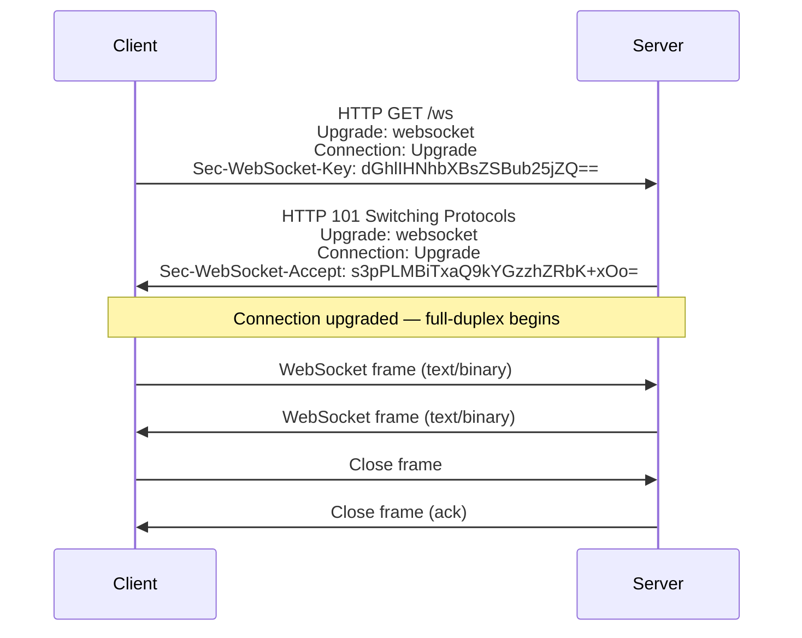

**Links**: [[WebSocket Deep Dive]] | [[WebRTC]] | [[HTTP Protocol]] | [[HTTP-3 and QUIC]] | [[Web Development Fundamentals]] | [[API Gateway Patterns]]

# WebSockets

WebSockets provide full-duplex communication over a single TCP connection, enabling real-time data flow between client and server without the overhead of repeated HTTP handshakes.

## Handshake Sequence



## Frame Format

WebSocket data is transmitted in frames. Each frame starts with 2–14 bytes of header:

| Field         | Size      | Description                              |
|---------------|-----------|------------------------------------------|
| FIN           | 1 bit     | Marks final fragment of a message        |
| RSV 1–3       | 1 bit ea  | Extension negotiation                    |
| Opcode        | 4 bits    | 0x1=text, 0x2=binary, 0x8=close, 0x9=ping |
| Mask          | 1 bit     | 1 = payload is masked (client→server)    |
| Payload Len   | 7/7+16/7+64 bits | Length of payload (small, medium, extended) |
| Masking Key   | 4 bytes   | Present only when Mask=1                 |
| Payload Data  | variable  | Actual application data                  |

Messages may be fragmented across multiple frames. Control frames (close, ping, pong) may interleave fragmented messages.

## WebSocket vs HTTP vs SSE vs Polling

| Feature            | WebSocket          | HTTP (fetch)       | SSE                | Polling            |
|--------------------|--------------------|--------------------|--------------------|--------------------|
| **Direction**      | Bidirectional      | Request/Response   | Server→Client      | Request/Response   |
| **Protocol**       | ws:// / wss://     | http:// / https:// | http:// / https:// | http:// / https:// |
| **Overhead**       | Low (after upgrade)| High (per request) | Medium             | Very high          |
| **Latency**        | Real-time          | Round-trip delay   | Near real-time     | Poll interval      |
| **Binary support** | Yes                | Yes                | No (text only)     | Yes                |
| **Auto-reconnect** | Manual             | Manual             | Built-in (EventSource)| N/A              |
| **Browser support**| Widespread         | Universal          | Good (no IE)       | Universal          |
| **Best for**       | Chat, games, live trading | REST APIs   | Notifications, feeds | Legacy fallback  |

## Reconnection Strategies

- **Exponential backoff**: Wait `min(2^n * base, max)` seconds between attempts (e.g., 1s, 2s, 4s, 8s...).
- **Jitter**: Add random ±50% to avoid thundering herd.
- **Heartbeat / ping-pong**: Send periodic pings to detect stale connections; reconnect on timeout.
- **Last-known-state recovery**: Store event ID or sequence number on client; request missed messages after reconnect.

### Example: Reconnection with Backoff

```javascript
function connectWithBackoff(url, maxRetries = 10) {
  let attempt = 0;

  function connect() {
    const ws = new WebSocket(url);
    ws.onopen = () => { attempt = 0; };
    ws.onclose = () => {
      if (attempt < maxRetries) {
        const delay = Math.min(1000 * 2 ** attempt + Math.random() * 1000, 30000);
        setTimeout(connect, delay);
        attempt++;
      }
    };
  }
  connect();
}
```

## Server Example (Python + FastAPI)

```python
from fastapi import FastAPI, WebSocket, WebSocketDisconnect
from typing import Set

app = FastAPI()
active_connections: Set[WebSocket] = set()

@app.websocket("/ws")
async def websocket_endpoint(websocket: WebSocket):
    await websocket.accept()
    active_connections.add(websocket)
    try:
        while True:
            data = await websocket.receive_text()
            # Broadcast to all connected clients
            for conn in active_connections:
                await conn.send_text(f"Broadcast: {data}")
    except WebSocketDisconnect:
        active_connections.discard(websocket)
```

## Use Cases

- **Live chat / instant messaging**: Bidirectional low-latency message delivery.
- **Real-time dashboards**: Push metrics, logs, or analytics without polling.
- **Collaborative editing**: Google Docs-style OT/CRDT sync over WebSocket.
- **Gaming / multiplayer state sync**: Sub-100ms frame delivery for game state.
- **Live notifications**: Push alerts, stock tickers, or social feeds.

**Links**: [[WebSocket Deep Dive]] | [[HTTP Protocol]] | [[REST API Design]] | [[Concurrency Models]] | [[Event-Driven Architecture]] | [[Message Queues]] | [[WebRTC]]

**See also**: [[Microservices Architecture]], [[API Gateway Patterns]], [[gRPC]]
