# 🌐 Web Development — Map of Content

Web development spans protocols, frontend frameworks, APIs, and emerging standards. This folder covers the full stack: HTTP protocol fundamentals, caching strategies, and real-time communication (WebSockets, WebRTC); frontend frameworks (React, Vue, Angular, Svelte); API design patterns (GraphQL, gRPC, REST); and next-gen technologies (WebAssembly, Web3). Start with [[Web-Dev/Web Development Fundamentals]] for a broad overview.

```mermaid
graph TD
  WEB["Web Development"] --> FUND["Fundamentals"]
  WEB --> PROTO["Protocols"]
  WEB --> FRONT["Frontend"]
  WEB --> API2["APIs"]
  WEB --> ARCH2["Architecture"]
  WEB --> MOB["Mobile & Desktop"]
  WEB --> NEXT["Next-Gen"]

  FUND --> WDF["Web Development Fundamentals"]
  FUND --> CSS["CSS & Styling"]
  FUND --> ACC["Web Accessibility"]

  PROTO --> HTTP["HTTP Protocol"]
  PROTO --> HC["HTTP Caching"]
  PROTO --> H3["HTTP-3 & QUIC"]
  PROTO --> WS["WebSockets"]
  PROTO --> WSD["WebSocket Deep Dive"]
  PROTO --> WRT["WebRTC"]

  FRONT --> REACT["React"]
  FRONT --> VUE["Vue.js"]
  FRONT --> ANG["Angular"]
  FRONT --> SVEL["Svelte"]
  FRONT --> NEXTJS["Next.js & Modern Frameworks"]
  FRONT --> SMP["State Management Patterns"]
  FRONT --> WC["Web Components"]
  FRONT --> MF["Micro-Frontends"]
  FRONT --> VITE["Vite & esbuild"]

  API2 --> GRAPH["GraphQL"]
  API2 --> GQLD["GraphQL API Design"]
  API2 --> GRPC["gRPC"]
  API2 --> AGP["API Gateway Patterns"]
  API2 --> AV["API Versioning"]
  API2 --> AD["API Documentation"]
  API2 --> ADO["API Documentation with OpenAPI"]

  ARCH2 --> WEBASM["WebAssembly"]
  ARCH2 --> WEB3["Web3 & Decentralized Apps"]

  MOB --> RN["React Native"]
  MOB --> DE["Desktop Apps with Electron & Tauri"]

  NEXT --> SA["Sorting Algorithms"]
  NEXT --> PV["Programming Languages & Paradigms"]
  WEB --> PWA["Progressive Web Apps"]
```

## Topics

| Category | Notes |
|----------|-------|
| **Fundamentals** | [[Web Development Fundamentals]], [[CSS and Styling]], [[Web Accessibility]] |
| **Protocols** | [[HTTP Protocol]], [[HTTP Caching]], [[HTTP-3 and QUIC]], [[WebSockets]], [[WebSocket Deep Dive]], [[WebRTC]] |
| **Frontend** | [[React]], [[Vue.js]], [[Angular]], [[Svelte]], [[Next.js and Modern Web Frameworks]], [[State Management Patterns]], [[Web Components]], [[Micro-Frontends]], [[Vite and esbuild]] |
| **APIs** | [[GraphQL]], [[GraphQL API Design]], [[gRPC]], [[API Gateway Patterns]], [[API Versioning]], [[API Documentation]], [[API Documentation with OpenAPI]] |
| **Mobile & Desktop** | [[React Native]], [[Desktop Apps with Electron and Tauri]] |
| **Mobile & Next-Gen** | [[React Native]], [[Desktop Apps with Electron and Tauri]], [[Progressive Web Apps]] |
| **Next-Gen** | [[WebAssembly]], [[Web3 and Decentralized Applications]] |

## Cross-Domain Links

- [[Web-Dev/Web Development Fundamentals]] → [[Security/Web Security]], [[Security/OWASP Top 10]]
- [[Web-Dev/HTTP Caching]] → [[System-Design/Databases/Caching Strategies]], [[System-Design/Architecture/CDN Architecture]]
- [[Web-Dev/React]] → [[Web-Dev/State Management Patterns]], [[Web-Dev/Next.js and Modern Web Frameworks]]
- [[Web-Dev/gRPC]] → [[DevOps/REST API Design]], [[System-Design/Architecture/Microservices Architecture]]
- [[Web-Dev/API Gateway Patterns]] → [[Security/API Security]], [[DevOps/REST API Design]]
- [[Web-Dev/WebSockets]] → [[System-Design/Architecture/Event-Driven Architecture]], [[System-Design/Databases/Message Queues]]
