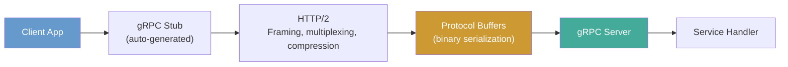

# gRPC

**Links**: [[REST API Design]] | [[HTTP Protocol]] | [[Data Serialization]] | [[Microservices Architecture]] | [[Service Mesh]] | [[API Gateway Patterns]] | [[Docker Containers]] | [[Kubernetes Basics]] | [[Envoy Proxy]]

**See also**: [[API Security]], [[Docker Compose]], [[Protocol Buffers]]

## What is gRPC?

gRPC is a high-performance RPC framework using HTTP/2 and Protocol Buffers. It enables strongly-typed, streaming API calls between services with automatic code generation for 11+ languages.

## gRPC Communication Flow



## Protocol Buffers (.proto)

```protobuf
syntax = "proto3";

package users;

service UserService {
    rpc GetUser (GetUserRequest) returns (User);
    rpc ListUsers (ListUsersRequest) returns (stream User);
    rpc UpdateUser (stream UpdateUserRequest) returns (User);
    rpc Chat (stream ChatMessage) returns (stream ChatMessage);
}

message User {
    int32 id = 1;
    string name = 2;
    string email = 3;
    repeated string roles = 4;
    Address address = 5;
}

message Address {
    string street = 1;
    string city = 2;
    string zip = 3;
}

message GetUserRequest {
    int32 id = 1;
}

message ListUsersRequest {
    int32 page_size = 1;
    string page_token = 2;
}

message UpdateUserRequest {
    int32 id = 1;
    string name = 2;
}

message ChatMessage {
    string user = 1;
    string text = 2;
}
```

Field numbers are compact identifiers used in the binary wire format — never renumber fields after deployment.

## Communication Patterns

| Pattern | Client | Server | Example |
|---------|--------|--------|---------|
| **Unary** | Single request | Single response | `GetUser`, `CreateOrder` |
| **Server Streaming** | Single request | Stream of responses | `ListUsers`, `SubscribeFeed` |
| **Client Streaming** | Stream of requests | Single response | `UploadFile`, `BatchProcess` |
| **Bidirectional** | Stream of requests | Stream of responses | `Chat`, `RealTimeGame` |

## Server (Python)

```python
import grpc
from concurrent import futures
import user_pb2, user_pb2_grpc

class UserServicer(user_pb2_grpc.UserServiceServicer):
    def GetUser(self, request, context):
        return user_pb2.User(
            id=request.id,
            name="Alice",
            email="alice@example.com"
        )

server = grpc.server(futures.ThreadPoolExecutor(max_workers=10))
user_pb2_grpc.add_UserServiceServicer_to_server(UserServicer(), server)
server.add_insecure_port('[::]:50051')
server.start()
server.wait_for_termination()
```

## Client

```python
import grpc
import user_pb2, user_pb2_grpc

channel = grpc.insecure_channel('localhost:50051')
stub = user_pb2_grpc.UserServiceStub(channel)
response = stub.GetUser(user_pb2.GetUserRequest(id=1))
print(f"User: {response.name}, {response.email}")
```

## gRPC vs REST vs GraphQL

| Aspect | gRPC | REST | GraphQL |
|--------|------|------|---------|
| Protocol | HTTP/2 | HTTP/1.1 | HTTP/1.1+ |
| Data Format | Protobuf (binary) | JSON (text) | JSON (text) |
| Contract | .proto (strict, code-gen) | OpenAPI (loose) | Schema (SDL) |
| Streaming | Native (all 4 patterns) | No (native) | Subscriptions only |
| Performance | 5–10x faster | Baseline | ~2x faster than REST |
| Payload Size | ~30% of JSON | Baseline | ~50% of REST |
| Browser Support | Needs gRPC-web proxy | Native | Native |
| Tooling | protoc, grpcurl | curl, Postman | GraphiQL, Apollo |

## Performance & Use Cases

| Scenario | Why gRPC |
|----------|----------|
| Microservices communication | Low latency, strong typing, native streaming |
| Real-time services (chat, gaming) | Bidirectional streaming over a single connection |
| Mobile / low-bandwidth | Small protobuf payloads save battery and data |
| Polyglot environments | Auto-generate clients in 11+ languages |
| IoT / constrained devices | Compact binary format minimizes overhead |
| Video transcoding / ML inference | High-throughput streaming with backpressure |

gRPC is not ideal for browser-only apps (without a proxy) or when human-readable payloads are required.

**Next**: [[Docker Compose]] — Multi-container Docker
