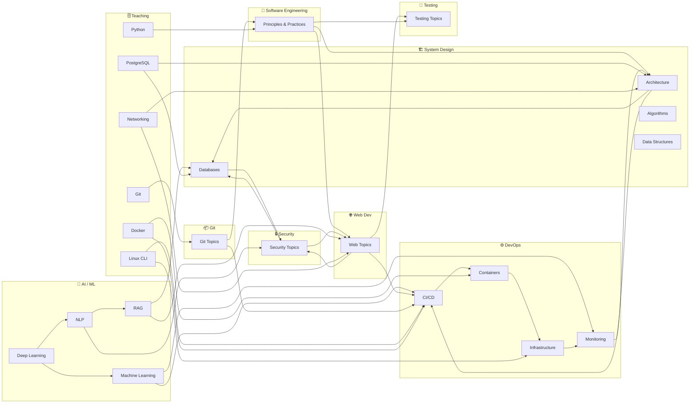

# 🗺️ Map of Content — Master Index

lumina-notes is a structured engineering knowledge base — 400+ interconnected notes across AI/ML, system design, databases, DevOps, security, and software engineering. Every folder contains a `_MOC.md` index (Map of Content) that links to all notes within it, forming a browsable knowledge graph. Use the mindmap below to navigate domains, then drill into any area via its MOC.

```mermaid
mindmap
  root((Tech Knowledge))
    AI-ML
      Deep-Learning
        Transformer_Architecture
        Self-Attention
        Multi-Head Attention
        Positional Encoding
        BERT_and_Encoder_Models
        GPT_and_Decoder_Models
        Attention_Mechanism
        Pre-training_and_Fine-tuning
        LoRA_and_PEFT
        Model_Distillation
        Mixture_of_Experts
        Scaling_Laws
        Flash_Attention
        KV_Cache_and_Inference
        Speculative_Decoding
        Long_Context_Transformers
        RNNs_and_LSTMs
        CNNs_for_NLP
        Sequence-to-Sequence
        Encoder-Decoder
        Computer_Vision
      NLP
        Tokenization
        Text_Embedding_Models
        Prompt_Engineering
        Advanced_Prompting
        Context_Window_Strategies
        LLM_Alignment
        LLM_Safety_and_Guardrails
        LLM_Evaluation_and_Benchmarks
        Tool_Use_and_Function_Calling
        Structured_Output_and_Grammar
        Quantization_for_LLMs
        Inference_Optimization
        Machine_Translation
        Sentiment_Analysis
        Text_Classification
        Named_Entity_Recognition
        NLP_Pipeline_Design
        LLM_Agents_Framework
      RAG
        RAG_Architecture
        Chunking_Strategies
        Embedding_Models_for_RAG
        Vector_Databases_for_RAG
        Retrieval_Strategies
        Reranking
        Prompt_Engineering_for_RAG
        Advanced_RAG_Patterns
        Agentic_RAG
        Graph_RAG
        Multi-Modal_RAG
        Hybrid_Search_for_RAG
        RAG_Pipeline_Optimization
        RAG_Evaluation_Metrics
        RAG_vs_Fine-tuning
      Machine-Learning
        MLOps
        Feature_Stores
        Model_Monitoring
        Responsible_and_Ethical_AI
        Synthetic_Data_Generation
        Causal_Inference
        Graph_Neural_Networks
        Information_Theory
        Neural_Architecture_Search
        Time_Series_Analysis
        Anomaly_Detection
        Recommender_Systems
        Clustering_Algorithms
        Decision_Trees_and_Random_Forests
        Gradient_Boosting
        Ensemble_Methods
        Hyperparameter_Tuning
        Dimensionality_Reduction
        Active_Learning
        Reinforcement_Learning
        Data_Augmentation_for_NLP
    DevOps
      CI-CD
        CI_CD_Pipelines
        GitHub_Actions
        GitLab_CI
        Jenkins
      Containers
        Docker_Containers
        Docker_Compose
        Docker_Networking_and_Storage
        Kubernetes_Basics
        Kubernetes_Deployments
      Infrastructure
        Infrastructure_as_Code
        Terraform
        Ansible
        Packer
        Vagrant
        Cloud_Computing
        Cloud_Cost_Optimization
        Edge_Computing
        Helm
        Nginx_Configuration
        Envoy_Proxy
        Consul
        Shell_Scripting
        Build_Tools
        Package_Managers
        Dev_Environment_Setup
        Developer_Workflow_Automation
      Monitoring
        Monitoring_and_Observability
        Prometheus_and_Monitoring_Systems
        Grafana_Deep_Dive
        OpenTelemetry_Deep_Dive
        Distributed_Tracing
        Logging_Best_Practices
        Service_Level_Objectives
        Site_Reliability_Engineering
        Chaos_Engineering
        Disaster_Recovery_Planning
      REST_API_Design
    System-Design
      Architecture
        System_Design_Fundamentals
        Architecture_Patterns
        Microservices_Architecture
        Event-Driven_Architecture
        Domain-Driven_Design
        CAP_Theorem_and_PACELC
        CDN_Architecture
        DNS_Deep_Dive
        Raft_Consensus_Algorithm
        Saga_and_Distributed_Transactions
        Service_Mesh
        Istio_Service_Mesh
        Serverless_Computing
        Computer_Networking
        Computer_Architecture
        Operating_Systems
        Memory_Management
        Concurrency_Models
        Blockchain_Fundamentals
        Code_Architecture_Patterns
      Databases
        SQL_vs_NoSQL
        Database_Indexing
        Database_Sharding
        Database_Replication
        Database_Transactions
        Database_Transaction_Isolation
        Caching_Strategies
        Consistent_Hashing
        Event_Sourcing
        Message_Queues
        Stream_Processing
        CAP_Theorem
        PostgreSQL_Features
        PostgreSQL_Performance_Tuning
        PostgreSQL_Extensions
        MongoDB
        MongoDB_Deep_Dive
        Cassandra
        Apache_Cassandra_Deep_Dive
        Redis_Deep_Dive
        Elasticsearch_Deep_Dive
        Kafka_Deep_Dive
        Apache_Spark
        Apache_Spark_Deep_Dive
        Apache_Flink
        Apache_Airflow
        ClickHouse
        DuckDB
        SQLite_Reference
        Neo4j_and_Graph_Databases
        Graph_Databases
        Time_Series_Databases
        Search_Engines
        Rate_Limiting
        Data_Engineering
        ETL_and_Data_Pipeline_Patterns
        Data_Warehouse_Modeling
        Data_Normalization_Rules
        Data_Serialization
        Database_Engines_Compared
        Snowflake_and_Data_Warehousing
        Delta_Lake_and_Apache_Iceberg
        LSM-Tree_Storage_Engines
        CRDTs
        UUID_vs_Snowflake_vs_ULID
        Database_Connection_Pooling
        Database_Migration_Tools
        Database_Backup_Strategies
        Database_Security
        Database_Triggers
        Database_Views
        DB_Relationship_Patterns
        SQL_JOIN_Operations
        SQL_Query_Optimization
      Algorithms
        Big_O_Notation
        Algorithm_Paradigms
        Computational_Complexity
        Graph_Algorithms
        Numerical_Methods
      Data-Structures
        Data_Structures_Overview
        Probabilistic_Data_Structures
    Software-Engineering
      SOLID_Principles
      Software_Design_Principles
      GoF_Design_Patterns
      Clean_Code_Principles
      Refactoring_Techniques
      Code_Review_Best_Practices
      Code_Review_Process
      Error_Handling_Patterns
      Debugging_Strategies
      Performance_Profiling
      Technical_Debt_Management
      Technical_Writing
      Agile_Development
      Scrum_Framework
      Estimation_and_Planning
      Incident_Response
      Feature_Flags_and_Toggles
      Monorepo_vs_Polyrepo
      Monorepo_with_Nx_and_Turborepo
      Internationalization
      Unicode_and_Encoding
      Regular_Expressions
      Onboarding_and_Mentoring
      Developer_Experience
      Open_Source
      Environment_Variables
      Coding_Interview_Patterns
      System_Design_Interview
      Programming_Resources
      Vim_and_Neovim
      Virtualization
    Security
      Web_Security
      OWASP_Top_10
      OAuth_and_Authentication_Protocols
      OAuth_2.0_in_Practice
      JSON_Web_Tokens
      SAML_and_Enterprise_SSO
      TLS_1.3_Deep_Dive
      Zero_Trust_Architecture
      Secure_Coding_Practices
      Threat_Modeling
      API_Security
      Kubernetes_Security
      Cryptography_Basics
      Vault_and_Secret_Management
      WireGuard_and_VPN_Technologies
    Testing
      Software_Testing_Pyramid
      Unit_Testing_Guide
      Integration_Testing_Patterns
      API_Testing
      Test-Driven_Development
      Load_Testing
      Performance_Testing
      Property-Based_Testing
      Mutation_Testing
      Snapshot_Testing
      Visual_Regression_Testing
    Web-Dev
      Web_Development_Fundamentals
      HTTP_Protocol
      HTTP_Caching
      HTTP-3_and_QUIC
      WebSockets
      WebSocket_Deep_Dive
      WebRTC
      Web_Accessibility
      Web_Components
      WebAssembly
      Web3_and_Decentralized_Apps
      HTML_CSS
      CSS_and_Styling
      JavaScript
      React
      React_Native
      Vue.js
      Angular
      Svelte
      Next.js_and_Modern_Frameworks
      State_Management_Patterns
      Micro-Frontends
      Desktop_Apps_with_Electron_and_Tauri
      GraphQL
      GraphQL_API_Design
      gRPC
      API_Gateway_Patterns
      API_Versioning
      API_Documentation
      API_Documentation_with_OpenAPI
      Vite_and_esbuild
      Mobile_Dev
      Programming_Languages
      Sorting_Algorithms
    Git
      Git_Overview
      Git_Installation
      Git_Configuration
      Git_Init_and_Clone
      Git_Add_and_Status
      Git_Commit
      Git_Branch
      Git_Merge
      Git_Rebase
      Git_Interactive_Rebase
      Git_Advanced_Merging
      Git_Conflict_Resolution
      Git_Cherry-Pick
      Git_Stash
      Git_Log
      Git_Diff
      Git_Reset
      Git_Restore
      Git_Revert
      Git_Clean
      Git_Push
      Git_Pull_and_Fetch
      Git_Remote
      Git_Tag
      Git_Worktrees
      Git_Submodules
      Git_Bisect
      Git_Blame
      Git_Hooks
      Git_Server_Hooks
      Git_Attributes
      Git_Ignore
      Git_LFS
      Git_Bundles
      Git_Archive
      Git_GPG
      Git_Aliases
      Git_Workflows
      Git_Pull_Requests
      Git_Internals_I
      Git_Internals_II
      Git_Internals_III
      Git_Best_Practices
    Teaching
      PostgreSQL_Mastery
        Query_Plans
        Indexing_Strategies
        MVCC_Internals
        VACUUM_and_Bloat
      Linux_CLI
        Shell_and_Filesystem
        Files_and_Permissions
        Pipes_and_Redirection
        Processes_and_Monitoring
        Networking_Essentials
        Shell_Scripting
        Package_Management
    Docker
      Running_Containers
    Git_Deep
      Objects_and_Data_Model
    Python
      Basics_and_First_Script
    Networking
      URL_to_Browser
```

---

---

## Quick Navigation

| Area                                                   | Description                                   | Notes     |
| ------------------------------------------------------ | --------------------------------------------- | --------- |
| [[AI-ML/_MOC\|🤖 AI / ML]]                             | Deep Learning, NLP, RAG, Machine Learning     | ~80 notes |
| [[DevOps/_MOC\|⚙️ DevOps]]                             | CI/CD, Containers, Infrastructure, Monitoring | ~40 notes |
| [[System-Design/_MOC\|🏗️ System Design]]              | Architecture, Databases, Algorithms           | ~85 notes |
| [[Software-Engineering/_MOC\|📐 Software Engineering]] | Principles, Patterns, Practices               | ~31 notes |
| [[Security/_MOC\|🔒 Security]]                         | Auth, Crypto, Network Security                | ~15 notes |
| [[Testing/_MOC\|🧪 Testing]]                           | Pyramids, Types, Methodologies                | ~11 notes |
| [[Web-Dev/_MOC\|🌐 Web Development]]                   | Frameworks, APIs, Protocols                   | ~31 notes |
| [[Git/_MOC\|📦 Git]]                                   | Reference notes + hands-on lessons             | ~46 notes |
| [[database/_MOC\|🗄️ Database Teaching]]                 | PostgreSQL: query plans, indexing, MVCC       | ~7 notes  |
| [[linux/_MOC\|🐧 Linux Teaching]]                       | CLI from basics to shell scripting            | ~12 notes |
| [[docker/_MOC\|🐳 Docker Teaching]]                     | Containers, images, Dockerfiles                | ~1 note   |
| [[python/_MOC\|🐍 Python Teaching]]                     | Scripting, automation, fundamentals            | ~1 note   |
| [[networking/_MOC\|🌐 Networking Teaching]]              | HTTP, DNS, TCP/IP, how the internet works     | ~1 note   |

---

## Cross-Domain Connections

| Connection                                                                                                                   | Why                                        |
| ---------------------------------------------------------------------------------------------------------------------------- | ------------------------------------------ |
| [[AI-ML/Deep-Learning/Machine-Learning/MLOps]] ↔ [[DevOps/CI-CD/CI CD Pipelines]]                                            | ML in production needs CI/CD               |
| [[AI-ML/RAG/Vector Databases for RAG]] ↔ [[System-Design/Databases/Search Engines]]                                          | Vector search overlaps with search engines |
| [[AI-ML/Deep-Learning/Machine-Learning/Model Monitoring in Production]] ↔ [[DevOps/Monitoring/Monitoring and Observability]] | Model monitoring = observability for ML    |
| [[Security/Web Security]] ↔ [[Web-Dev/Web Development Fundamentals]]                                                         | Every web dev must know security           |
| [[Testing/API Testing]] ↔ [[DevOps/CI-CD/CI CD Pipelines]]                                                                   | Tests in pipelines                         |
| [[DevOps/REST API Design]] ↔ [[Web-Dev/API Gateway Patterns]]                                                                | API design + gateway patterns              |
| [[System-Design/Databases/Caching Strategies]] ↔ [[Web-Dev/HTTP Caching]]                                                    | Multi-layer caching                        |
| [[AI-ML/RAG/RAG Architecture]] ↔ [[System-Design/Databases/Vector Databases for RAG]]                                        | RAG needs vector databases                 |
| [[Security/OAuth and Authentication Protocols]] ↔ [[Web-Dev/Web Development Fundamentals]]                                   | Auth in web apps                           |
| [[AI-ML/Deep-Learning/Machine-Learning/Hyperparameter Tuning]] ↔ [[System-Design/Architecture/Architecture Patterns]] | Tuning at scale needs architecture |
| [[AI-ML/Deep-Learning/RLHF and Preference Optimization]] ↔ [[AI-ML/NLP/LLM Alignment]] | RLHF is the key alignment technique |
| [[AI-ML/Deep-Learning/Multi-Agent Orchestration]] ↔ [[System-Design/Architecture/Microservices Architecture]] | Multi-agent systems mirror microservice patterns |
| [[AI-ML/Deep-Learning/Diffusion Models]] ↔ [[AI-ML/Deep-Learning/Transformer Architecture]] | Modern diffusion models use transformer backbones |
| [[AI-ML/Deep-Learning/LLMOps and AI Observability]] ↔ [[DevOps/Monitoring/Monitoring and Observability]] | LLMOps extends observability to AI systems |
| [[Web-Dev/Progressive Web Apps]] ↔ [[Web-Dev/Web Development Fundamentals]] | PWAs bring native capabilities to the web |
|                                                                                                                              |                                            |
|                                                                                                                              |                                            |
|                                                                                                                              |                                            |
|                                                                                                                              |                                            |
|                                                                                                                              |                                            |
