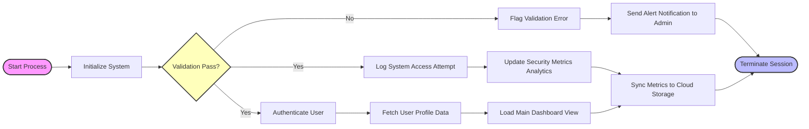

| one | two | three | four | five |
| --- | --- | --- | --- | --- |
|  |  |  |  |  |
|  |  | [[0001-basics-and-first-script]] |  |  |
|  |  | [[0001-command-cheatsheet]] |  |  |
|  |  | [[LEARNING_ROADMAP]] |  |  |

[[0001-git-objects-and-data-model]]


```mermaid 
graph TD
A-->B;
````

  

```mermaid
graph LR
    %% Global Styling & Spacing
    %% Using multiple dashes (--->) forces the layout engine to stretch horizontally.

    subgraph Phase 1: Intake & Validation
        Start([Start: User Submits Request]) ---> Init[1. Initialize & Log Request]
        Init ---> Check{1. Request Valid?}
    end

    subgraph Phase 2: Triage & Routing
        Check -- No ---> NotifyFail[2. Notify User: Incomplete]
        NotifyFail ---> Denied([End: Request Denied])
        
        Check -- Yes ---> Categorize[3. Categorize Request]
    end

    subgraph Phase 3: Parallel Processing & Review
        Categorize --->|Route Alpha| AlphaAssign[4a. Assign to Team Alpha]
        Categorize --->|Route Beta| BetaAssign[4b. Assign to Team Beta]
        
        AlphaAssign ----> AlphaReview[5a. Team Alpha Review]
        BetaAssign ----> BetaReview[5b. Team Beta Review]
        
        AlphaReview ---> AlphaCheck{6a. Internal Approval?}
        BetaReview ---> BetaCheck{6b. Needs Research?}
    end

    subgraph Phase 4: Resolution & Verification
        AlphaCheck -- No ---> Revision[7a. Request Revision]
        AlphaCheck -- Yes ---> Impl1[8a. Implementation: Task Set 1]
        
        BetaCheck -- Yes ---> Research[7b. Conduct Research]
        BetaCheck -- No ---> Impl2[8b. Implementation: Task Set 2]
        
        Revision ----> Execute[9. Execute Action & Monitor]
        Research ----> Execute
        Impl1 ----> Execute
        Impl2 ----> Execute
        
        Execute ----> Verify{10. Verification Pass?}
    end

    subgraph Phase 5: Closure
        Verify -- No ---> Rework[10a. Rework Required]
        Rework ----> Categorize
        
        Verify -- Yes ---> Report[11. Prepare Final Report]
        Report ---> Close[12. Notify Requester & Close]
        Close ---> Complete([End: Workflow Complete])
    end

    %% Style Adjustments for Visual Separation
    classDef startEnd fill:#bbf,stroke:#333,stroke-width:2px;
    classDef decision fill:#ffb,stroke:#333,stroke-width:2px;
    classDef step fill:#f9f,stroke:#333,stroke-width:1px;
    
    class Start,Denied,Complete startEnd;
    class Check,AlphaCheck,BetaCheck,Verify decision;
    
```




